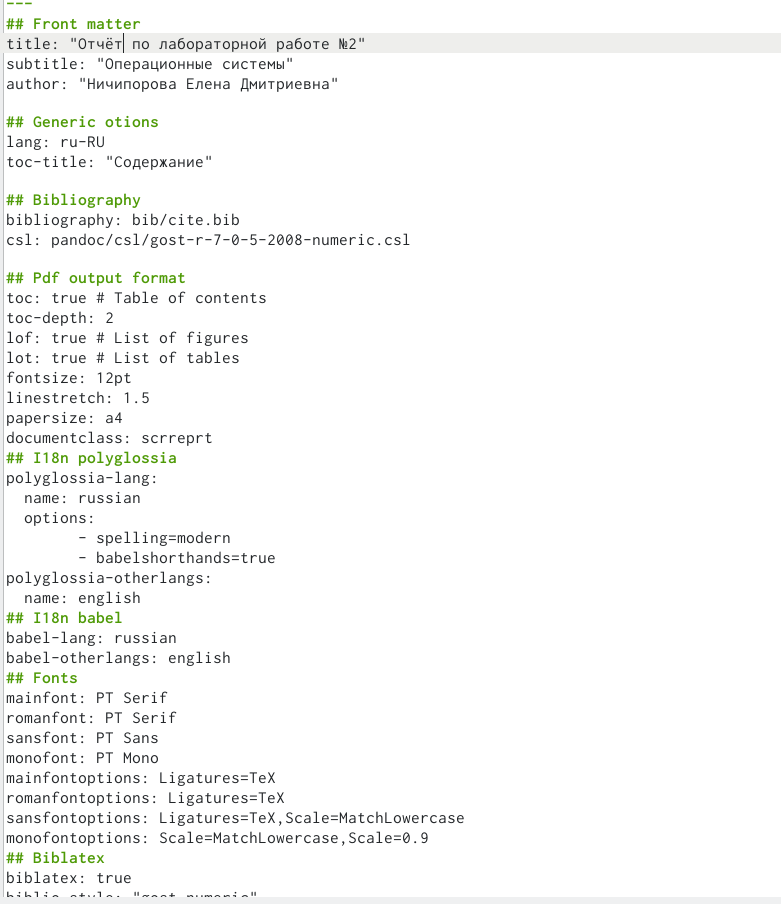
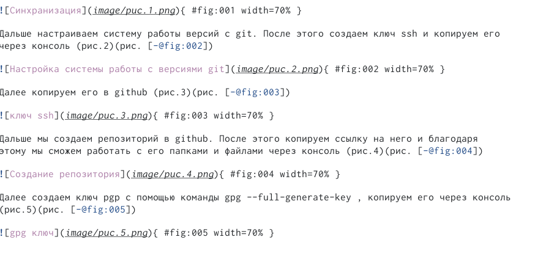
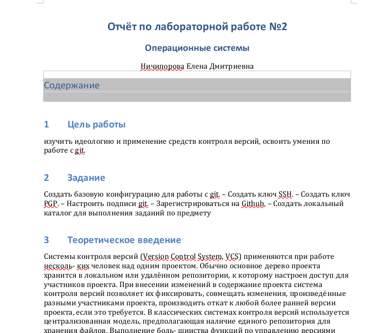
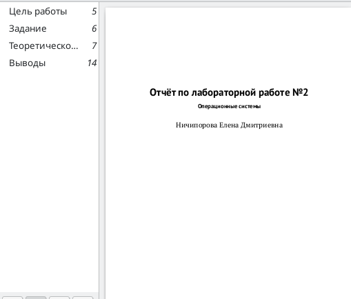

---
## Front matter
lang: ru-RU
title: Отчет по лабораторной работе №3
author: |
	Ничипорова Елена
institute: |
	РУДН,Москва
date: 27.04.22

## Formatting
toc: false
slide_level: 2
theme: metropolis
header-includes: 
 - \metroset{progressbar=frametitle,sectionpage=progressbar,numbering=fraction}
 - '\makeatletter'
 - '\beamer@ignorenonframefalse'
 - '\makeatother'
aspectratio: 43
section-titles: true
---

# Отчет по лабораторной работе №3

## Работа с Markdown

- Целью лабораторной работы было научиться работать с Markdown

- Для этого мы должны были сделать отчет по лабораторной №2 в Markdown

(рис. [-@fig:0011])

{ #fig:0011 width=70% }

## Оформляем ход работы

- расписываем полностью алгорит работы с прошлой лабораторной работы

- оформление отчета в Markdown: обязательно указывать полную ссылку для каждого изображения
(рис. [-@fig:0012])

{ #fig:0012 width=70% }

## Выполнение лаборатороной работы

-На следующих скриншотах представлен алгорит выполнение лабораторной №2 в Markdown
(рис. [-@fig:0013])

{ #fig:0013 width=70% }

(рис. [-@fig:0014])

{ #fig:0014 width=70% }

## Создание отчета в трех форматах

С помощью команды make мы можем дополнительно создать два файла в формате pdf и docx.На следующих скриншотах представлены отчеты лабораторной №2 в разных форматах.

## Выводы

- научилась работать с Markdown;
- научилась создавать pdf и docx файлы из файла Markdown (с помощью команды make);
- сделала отчет по предыдущей лабораторной работе в формате Markdown

## {.standout}

Wer's nicht glaubt, bezahlt einen Taler
