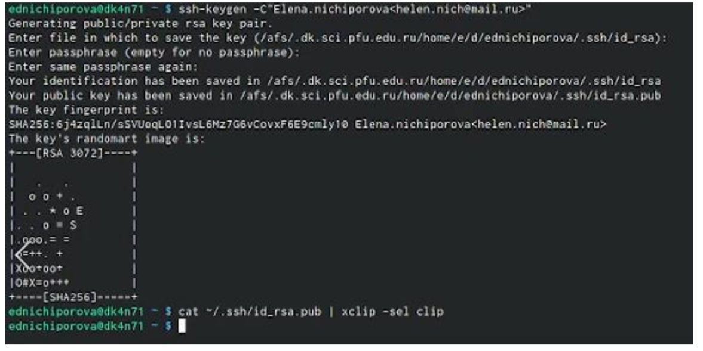
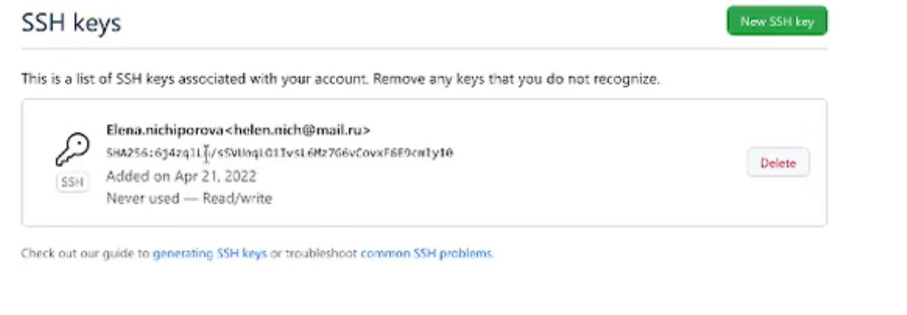
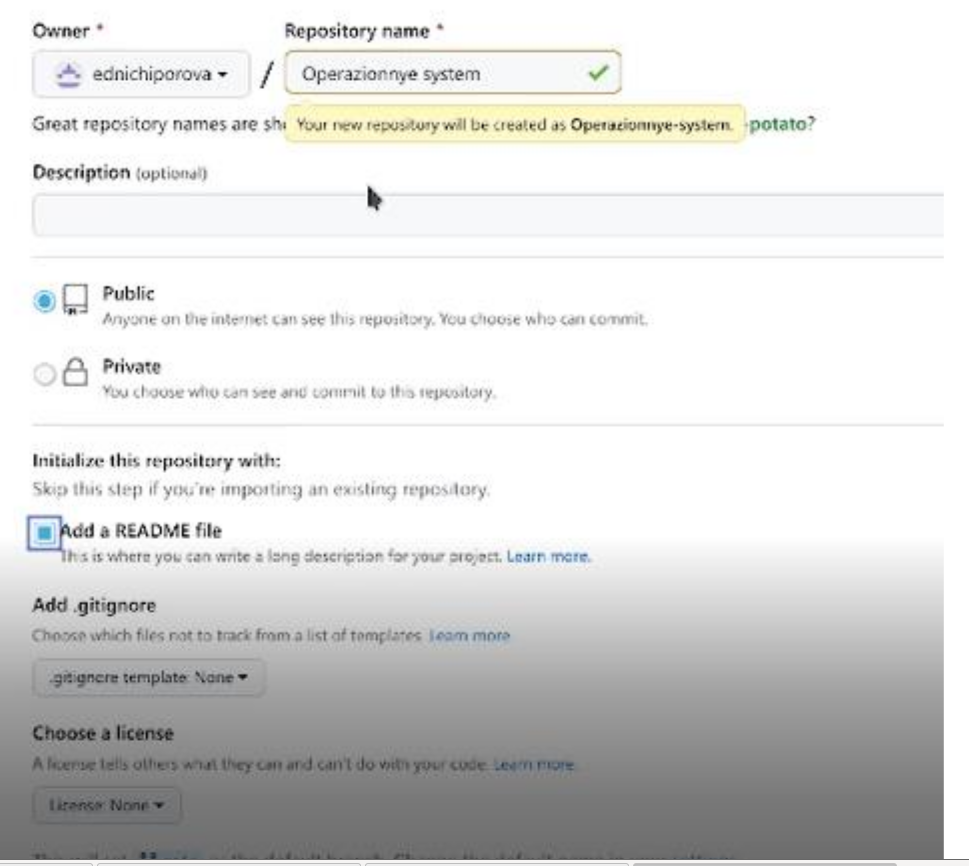
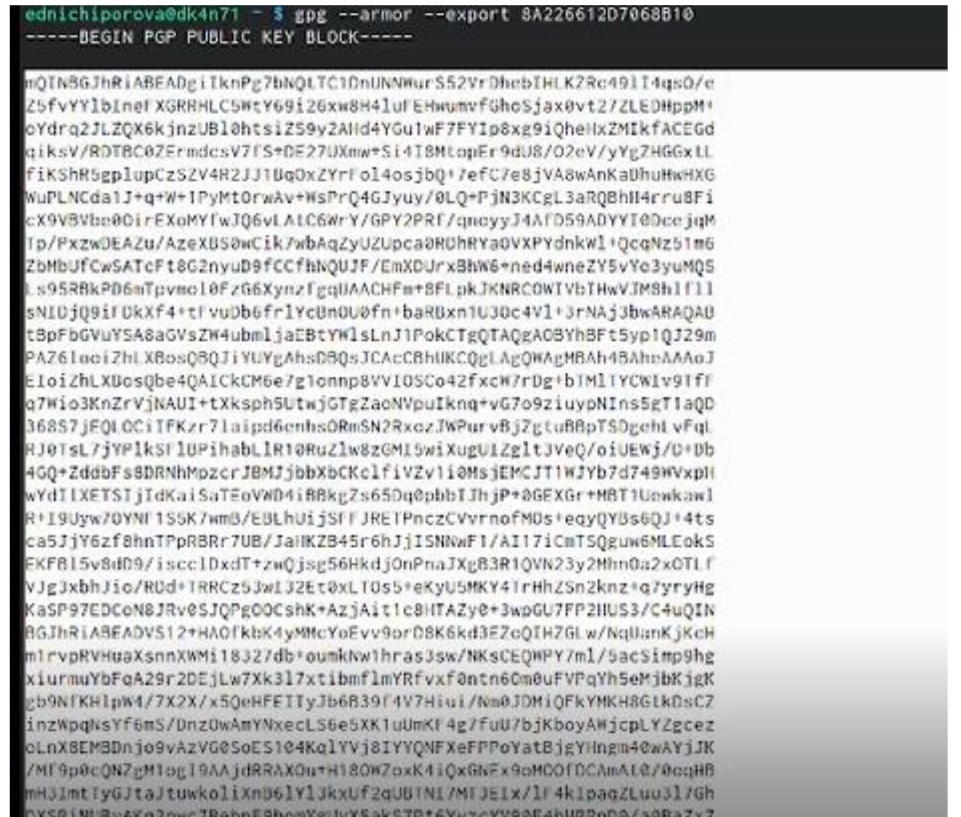
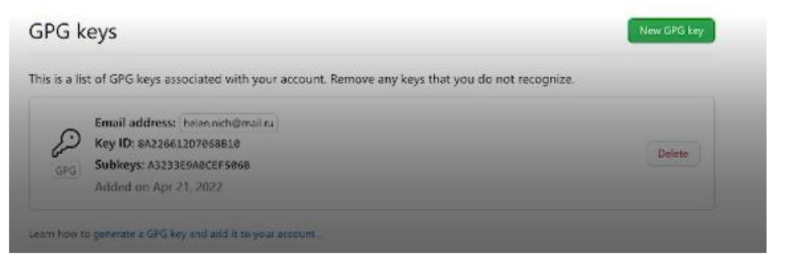
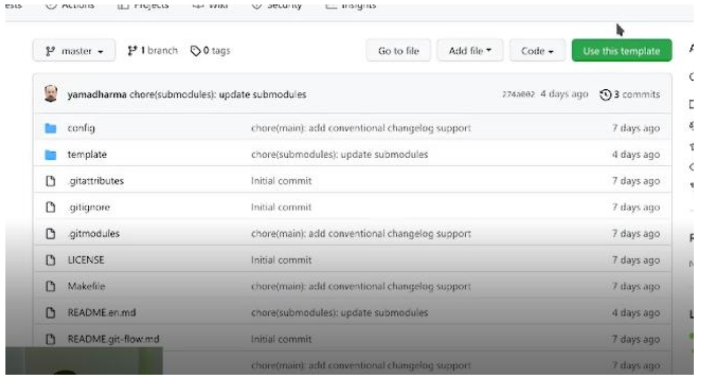
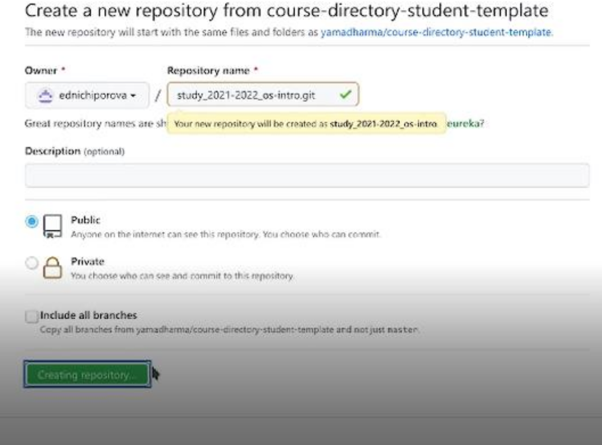
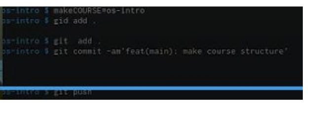

---
## Front matter
title: "Отчёт по лабораторной работе №2"
subtitle: "Операционные системы"
author: "Ничипорова Елена Дмитриевна"

## Generic otions
lang: ru-RU
toc-title: "Содержание"

## Bibliography
bibliography: bib/cite.bib
csl: pandoc/csl/gost-r-7-0-5-2008-numeric.csl

## Pdf output format
toc: true # Table of contents
toc-depth: 2
lof: true # List of figures
lot: true # List of tables
fontsize: 12pt
linestretch: 1.5
papersize: a4
documentclass: scrreprt
## I18n polyglossia
polyglossia-lang:
  name: russian
  options:
	- spelling=modern
	- babelshorthands=true
polyglossia-otherlangs:
  name: english
## I18n babel
babel-lang: russian
babel-otherlangs: english
## Fonts
mainfont: PT Serif
romanfont: PT Serif
sansfont: PT Sans
monofont: PT Mono
mainfontoptions: Ligatures=TeX
romanfontoptions: Ligatures=TeX
sansfontoptions: Ligatures=TeX,Scale=MatchLowercase
monofontoptions: Scale=MatchLowercase,Scale=0.9
## Biblatex
biblatex: true
biblio-style: "gost-numeric"
biblatexoptions:
  - parentracker=true
  - backend=biber
  - hyperref=auto
  - language=auto
  - autolang=other*
  - citestyle=gost-numeric
## Pandoc-crossref LaTeX customization
figureTitle: "Рис."
tableTitle: "Таблица"
listingTitle: "Листинг"
lofTitle: "Список иллюстраций"
lotTitle: "Список таблиц"
lolTitle: "Листинги"
## Misc options
indent: true
header-includes:
  - \usepackage{indentfirst}
  - \usepackage{float} # keep figures where there are in the text
  - \floatplacement{figure}{H} # keep figures where there are in the text
---

# Цель работы

изучить идеологию и применение средств контроля версий, освоить умения по
работе с git.

# Задание

Создать базовую конфигурацию для работы с git.
– Создать ключ SSH.
– Создать ключ PGP.
– Настроить подписи git.
– Зарегистрироваться на Github.
– Создать локальный каталог для выполнения заданий по предмету

# Теоретическое введение

Системы контроля версий (Version Control System, VCS) применяются при работе несколь-
ких человек над одним проектом. Обычно основное дерево проекта хранится в локальном
или удалённом репозитории, к которому настроен доступ для участников проекта. При
внесении изменений в содержание проекта система контроля версий позволяет их
фиксировать, совмещать изменения, произведённые разными участниками проекта,
производить откат к любой более ранней версии проекта, если это требуется.
В классических системах контроля версий используется централизованная модель,
предполагающая наличие единого репозитория для хранения файлов. Выполнение боль-
шинства функций по управлению версиями осуществляется специальным сервером.
Участник проекта (пользователь) перед началом работы посредством определённых
команд получает нужную ему версию файлов. После внесения изменений, пользователь
размещает новую версию в хранилище. При этом предыдущие версии не удаляются
из центрального хранилища и к ним можно вернуться в любой момент. Сервер может
сохранять не полную версию изменённых файлов, а производить так называемую дельта-
компрессию — сохранять только изменения между последовательными версиями, что
позволяет уменьшить объём хранимых данных.
Системы контроля версий поддерживают возможность отслеживания и разрешения
конфликтов, которые могут возникнуть при работе нескольких человек над одним
файлом. Можно объединить (слить) изменения, сделанные разными участниками (авто-
матически или вручную), вручную выбрать нужную версию, отменить изменения вовсе
или заблокировать файлы для изменения. В зависимости от настроек блокировка не
позволяет другим пользователям получить рабочую копию или препятствует изменению
рабочей копии файла средствами файловой системы ОС, обеспечивая таким образом,
привилегированный доступ только одному пользователю, работающему с файлом.
Системы контроля версий также могут обеспечивать дополнительные, более гибкие
функциональные возможности. Например, они могут поддерживать работу с нескольки-
ми версиями одного файла, сохраняя общую историю изменений до точки ветвления
версий и собственные истории изменений каждой ветви. Кроме того, обычно доступна
информация о том, кто из участников, когда и какие изменения вносил. Обычно такого
рода информация хранится в журнале изменений, доступ к которому можно ограничить.
В отличие от классических, в распределённых системах контроля версий центральный
репозиторий не является обязательным.
Среди классических VCS наиболее известны CVS, Subversion, а среди распределён-
ных — Git, Bazaar, Mercurial. Принципы их работы схожи, отличаются они в основном
синтаксисом используемых в работе команд.
# Выполнение лабораторной работы

Изначально я зарегистрировалась на github. Затем синхронизируем учетную запись с
компьютером через консоль (рис.1) (рис. [-@fig:001])

{ #fig:001 width=70% }

Дальше настраиваем систему работы версий с git. После этого создаем ключ ssh и копируем его
через консоль (рис.2)(рис. [-@fig:002])

{ #fig:002 width=70% }

Далее копируем его в github (рис.3)(рис. [-@fig:003])

{ #fig:003 width=70% }

Дальше мы создаем репозиторий в github. После этого копируем ссылку на него и благодаря
этому мы сможем работать с его папками и файлами через консоль (рис.4)(рис. [-@fig:004])

{ #fig:004 width=70% }

Далее создаем ключ pgp с помощью команды gpg --full-generate-key , копируем его через консоль
(рис.5)(рис. [-@fig:005])

{ #fig:005 width=70% }

Переходим в настройки github и вставляем полученный ключ(рис.6)(рис. [-@fig:006])

{ #fig:006 width=70% }

Дальше создаем репозиторий курса на основе шаблона. Для этого создаем шаблон рабочего
пространства с помощью команд (рис.7)(рис. [-@fig:007])

{ #fig:007 width=70% }

Используем уже созданный репозиторий (рис.8)(рис. [-@fig:008])

{ #fig:008 width=70% }

Создаем новый репозиторий(рис.9)(рис. [-@fig:009])

{ #fig:009 width=70% }

Далее настраиваем каталог курса , то есть удаляем ненужные файлы, создаем необходимые
каталоги и отправляем файлы на сервер (рис.10).(рис. [-@fig:0010])

{ #fig:0010 width=70% }

# Выводы

В данной лабораторной работе я научилась работать с Github (создавать и привязывать учетную
запись к компьютеру). Разобрала основные команды git и рассмотрела как их применять их при
работе с Github. Изучила идеологию и научилась применять средства контроля версий.

