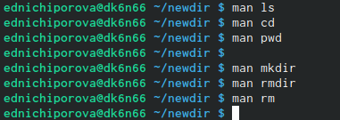

---
## Front matter
title: "Отчет по лабораторной работе №4"
subtitle: "Операционные системы"
author: "Ничипорова Елена Дмириевна"

## Generic otions
lang: ru-RU
toc-title: "Содержание"

## Bibliography
bibliography: bib/cite.bib
csl: pandoc/csl/gost-r-7-0-5-2008-numeric.csl

## Pdf output format
toc: true # Table of contents
toc-depth: 2
lof: true # List of figures
lot: true # List of tables
fontsize: 12pt
linestretch: 1.5
papersize: a4
documentclass: scrreprt
## I18n polyglossia
polyglossia-lang:
  name: russian
  options:
	- spelling=modern
	- babelshorthands=true
polyglossia-otherlangs:
  name: english
## I18n babel
babel-lang: russian
babel-otherlangs: english
## Fonts
mainfont: PT Serif
romanfont: PT Serif
sansfont: PT Sans
monofont: PT Mono
mainfontoptions: Ligatures=TeX
romanfontoptions: Ligatures=TeX
sansfontoptions: Ligatures=TeX,Scale=MatchLowercase
monofontoptions: Scale=MatchLowercase,Scale=0.9
## Biblatex
biblatex: true
biblio-style: "gost-numeric"
biblatexoptions:
  - parentracker=true
  - backend=biber
  - hyperref=auto
  - language=auto
  - autolang=other*
  - citestyle=gost-numeric
## Pandoc-crossref LaTeX customization
figureTitle: "Рис."
tableTitle: "Таблица"
listingTitle: "Листинг"
lofTitle: "Список иллюстраций"
lotTitle: "Список таблиц"
lolTitle: "Листинги"
## Misc options
indent: true
header-includes:
  - \usepackage{indentfirst}
  - \usepackage{float} # keep figures where there are in the text
  - \floatplacement{figure}{H} # keep figures where there are in the text
---

# Цель работы

Приобретение практических навыков взаимодействия пользователя с системой по-средством командной строки.wn.

# Ход работы

- Определяем полное имя своего домашнего каталога(рис. [-@fig:001])

{ #fig:001 width=70% }

- Переходим в каталог /tmp и выводим его содержимое на экран. Для этого используем команду ls с различными опциями: ls (используется для просмотра содержимого каталога);ls -a(отображение имен скрытых файлов); ls -F(получение информации о типах файлов); ls -l(вывод информации о файлах и каталогов); ls -alF(отображение списка всех каталогов и файлов, в том числе и скрытых, с подробной информацией о них)(рис. [-@fig:002])

{ #fig:002 width=70% }

- Переходим в каталог var/spool. посмотрим его содержимое с помощью команды ls.Таким образом, мы удостоверимся,что данных каталог cron существует.(рис. [-@fig:003])

{ #fig:003 width=70% }

- Переходим в домашний каталог и проверяем его содержимое. Владельцем файлов и подкаталогов является ednichiporova (рис. [-@fig:004])

{ #fig:004 width=70% }

- Далее в домашнем каталоге создаем новый каталог newdir(рис. [-@fig:005]) . В каталоге ~/newdir создаем каталог с именем morefun. С помощью кманды ls проверяем правильность моих действий(рис. [-@fig:006])

{ #fig:005 width=70% }
{ #fig:006 width=70% }

- В домашнем каталоге создаем с помощью одной команды (mkdir) три новых каталога (рис. [-@fig:007]) и удаляем их одной командой(рис. [-@fig:008])

{ #fig:007 width=70% }

{ #fig:008 width=70% }

- Попробуем удалить ранее созданный каталог ~/newdir командой rm.Каталог не был удален, так как данный каталог содержит подкаталог и требует при удалении использовать опцию -r(рис. [-@fig:009])

{ #fig:009 width=70% }

- Удаляем каталог ~/newdir/morefun из домашнего каталога.Командой ls проверяем правильность моих действий(рис. [-@fig:0010])

{ #fig:0010 width=70% }

- используя команду man l, определяем, какую опцию команды ls надо использовать, чтобы просмотреть содержимоене только указанного каталога, но и подкаталогов, входящих в него(рис. [-@fig:0011])

{ #fig:0011 width=70% }

- Использя то же руководство по команде ls определяем набор опций этой команды. Данный набор опций позволяет отсортировать по времени последнего изменения выводимый список содержимого каталогас развёрнутым описанием файлов.

- Используем команду man для просмотра описания следующих команд:cd,pwd,mkdir,rmdir,rm (рис. [-@fig:0012])

{ #fig:0012 width=70% }

- Команда pwd (рис. [-@fig:0013])

    -L, --logical - не разыменовывать символические ссылки. Если путь содержит ссылки, то выводить их без преобразования в исходный путь;
    -P, --physical - преобразовывать символические ссылки в исходные имена. Если путь содержит данные ссылки, то они будут преобразованы в названия исходных директорий (на которые они указаны).
    --help - показать справку по команде pwd;
    --version - показать версию утилиты pwd.
{ #fig:0013 width=70% }

- Команда mkdir (рис. [-@fig:0014])

    -m,--mode=MODE - устанавливает права доступа для создаваемой директории. Синтаксис MODE такой же как у команды chmod;
    -p,--parents - создаёт все директории, которые указаны внутри пути (если директория существует, сообщение об этом не выводится);
    -v, --verbose - выводит сообщение о каждой создаваемой директории;
    -z - устанавливает контекст SELinux для создаваемой директории по умолчанию;
    --context[=CTX] - устанавливает контекст SELinux для создаваемой директории в значение CTX;
    --help - показывает справку по команде mkdir;
    --version - показывает версию утилиты mkdir.
{ #fig:0014 width=70% }
    
- Команда rmdir (рис. [-@fig:0015])

    --ignore-fail-on-non-empty - игнорировать директории, которые содержат в себе файлы;
    -p, --parents - в этой опции каждый аргумент каталога обрабатывается как путь, из которого будут удалены все компоненты, если они уже пусты, начиная с последнего компонента;
    -v, --verbose - отображение подробной информациидля каждого обрабатываемого каталога;
    --help - показать справку по команде rmdir;
    --version - показать версию утилиты rmdir.
{ #fig:0015 width=70% }

- Команда rm (рис. [-@fig:0016])

    -f, --force - игнорировать несуществующие файлы и аргументы. Никогда не выдавать запросы на подтверждение удаления;
    -i - выводить запрос на подтверждение удаления каждого файла;
    -I - выдать один запрос на подтверждение удаления всех файлов, если удаляется больше трех файлов или используется рекурсивное удаление. Опция применяется, как более «щадящая» версия опции –i;
    --interactive[=WHEN] - вместо WHEN можно использовать:never — никогда не выдавать запросы на подтверждение удаления, once — выводить запрос один раз (аналог опции -I). always —выводить запрос всегда (аналог опции -i).Если значение КОГДА не задано, то используется always;
    --one-file-system - во время рекурсивного удаления пропускать директории, которые находятся на других файловых системах;
    --no-preserve-root - если в качестве директории для удаления задан корневой раздел /, то считать, что это обычная директория и начать выполнять удаление;
    --preserve-root[=all] - если в качестве директории для удаления задан корневой раздел /, то запретить выполнять команду rm над корневым разделом. Данное поведение используется по умолчанию;
    -r, -R, --recursive - удаление директорий и их содержимого. Рекурсивное удаление;
    -d, --dir - удалять пустые директории;
    -v, --verbose - выводить информацию об удаляемых файлах;
    --help - показать справку по команде rm;
    --version - показать версию утилиты rm
{ #fig:0016 width=70% }
    

- выводим историю команд с помощью команды history(рис. [-@fig:0017]). Далее выполняем несколко команд из буфера команд(рис. [-@fig:0018])

{ #fig:0017 width=70% }

{ #fig:0018 width=70% }

- Контрольные вопросы:1). Командная строка – специальная программа, позволяющая управлять операционной системой при помощи текстовых команд, вводимых в окне приложения. 2). Для определения абсолютного пути к текущему каталогу используется команда pwd (print working directory). Например, команда «pwd» в моем домашнем каталоге выведет: /home/tbkonovalova 3). Команда «ls-F» (или «ls-aF», тогда появятся еще скрытые файлы) выведет имена файлов в текущем каталоге и их типы. Тип каталога обозначается /, тип исполняемого файла обозначается , тип ссылки обозначается @. Пример на Рисунке 2. 4). Имена скрытых файлов начинаются с точки. Эти файлы в операционной системе скрыты от просмотра и обычно используются для настройки рабочей среды. Для того, чтобы отобразить имена скрытых файлов, необходимо использовать команду «ls –a». Пример на Рисунке 2. 5). Команда rm используется для удаления файлов и/или каталогов. Команда rm-i выдает запрос подтверждения наудаление файла. Команда rm-r необходима, чтобы удалить каталог, содержащий файлы. Без указания этой опции команда не будет выполняться. Если каталог пуст, то можно воспользоваться командой rmdir. Если удаляемый каталог содержит файлы, то команда не будет выполнена –нужно использовать «rm -r имя_каталога».Таким образом, каталог, не содержащий файлов, можно удалить и командой rm, и командой rmdir. Файл командой rmdir удалить нельзя. Примеры на Рисунке 9. 6). Чтобы определить, какие команды выполнил пользователь в сеансе работы, необходимо воспользоваться командой «history». 7). Чтобы исправить илизапустить на выполнение команду, которую пользователь уже использовал в сеансе работы, необходимо: в первом случае:воспользоваться конструкцией !<номер_команды>:s/<что_меняем>/<на_что_меняем>, во втором случае: !<номер_команды>. Примеры на Рисунке 21. 8). Чтобы записать в одной строке несколько команд, необходимо между ними поставить ; . Например, «cd /tmp; ls». 9). Символ обратного слэша позволяет использовать управляющие символы (".", "/", "$", "", "[", "]", "^", "&") без их интерпретации командной оболочкой; процедура добавления данного символа перед управляющими символами называетсяэкранированием символов. Например, команда «lsnewdir/morefun» отобразит содержимое каталога newdir/morefun. 10). Команда «ls -l» отображает список каталогов и файлов с подробной информацией о них (тип файла, право доступа, число ссылок, владелец, размер, дата последней ревизии, имя файла или каталога). 11). Полный, абсолютный путь от корня файловой системы –этот путь начинается от корня "/" и описывает весь путь к файлуили каталогу; Относительный путь – это путь к файлу относительно текущего каталога(каталога, где находится пользователь). Например, «cd/newdir/morefun» – абсолютный путь, «cdnewdir» – относительный путь. 12). Чтобы получить необходимую информацию о команде, необходимо воспользоваться конструкцией man[имя_команды], либо использовать опцию help, которая предусмотрена для некоторых команд. 13). Для автоматического дополнения вводимых команд служит клавиша Tab.
# Выводы

Приобрела практические навыки взаимодействия пользователя с системой посредством командной строки.

::: {#refs}
:::
