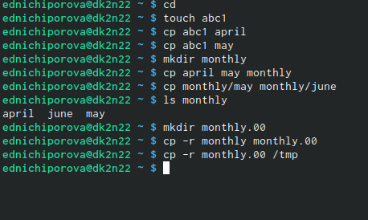
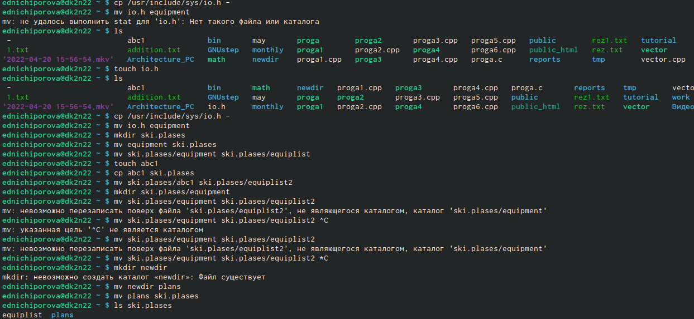
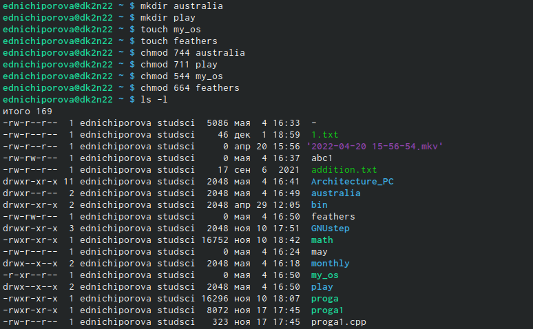
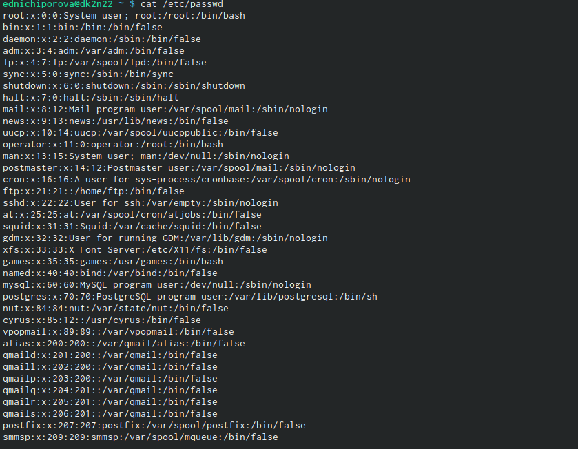
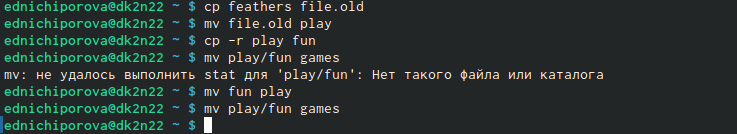
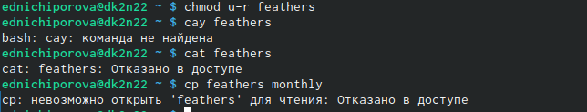
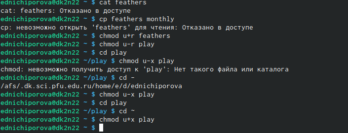

---
## Front matter
lang: ru-RU
title: Structural approach to the deep learning method
author: |
	Ничипорова Елена
institute: |
	РУДН,Москва
date: 4-05-22

## Formatting
toc: false
slide_level: 2
theme: metropolis
header-includes: 
 - \metroset{progressbar=frametitle,sectionpage=progressbar,numbering=fraction}
 - '\makeatletter'
 - '\beamer@ignorenonframefalse'
 - '\makeatother'
aspectratio: 43
section-titles: true
---

# Отчет по лабораторной работе

## Цель
Ознакомление с файловой системой Linux, её структурой, именами и содержанием
каталогов. Приобретение практических навыков по применению команд для работы
с файлами и каталогами, по управлению процессами (и работами), по проверке использования диска и обслуживанию файловой системы.

## Выполнение 

Выполняю все примеры, приведенные в первой части описания лабораторной работы 
- Выполняю примеры из пункта 5.2.2 (рис.1)(рис. [-@fig:001])

{ #fig:001 width=70% }

## Выполнение
После выполнения примеров, делаю следующие задания:Скопируйте файл /usr/include/sys/io.h в домашний каталог и назовите его
equipment. Если файла io.h нет, то используйте любой другой файл в каталоге
/usr/include/sys/ вместо него; в домашнем каталоге создайте директорию ~/ski.plases; переместите файл equipment в каталог ~/ski.plases; переименуйте файл ~/ski.plases/equipment в ~/ski.plases/equiplist; создайте в домашнем каталоге файл abc1 и скопируйте его в каталог
~/ski.plases, назовите его equiplist2; Ссоздайте каталог с именем equipment в каталоге ~/ski.plases;переместите файлы ~/ski.plases/equiplist и equiplist2 в каталог
~/ski.plases/equipment; создайте и переместите каталог ~/newdir в каталог ~/ski.plases и назовите его plans.(рис. 4)(рис. [-@fig:004])

{ #fig:004 width=70% }

## Выполнение

Далеесозданю необходимы файлы. Определяю опции командой chmod, необходимые для того, чтобы присвоить перечисленным в задании файлам выделенные права доступа, считая, что в начале таких прав нет (рис.5)(рис. [-@fig:005])

{ #fig:005 width=70% }

## Выполнение
Просмотрите содержимое файла /etc/password.(рис.6)(рис. [-@fig:006])

{ #fig:006 width=70% }
- Скопируйте файл ~/feathers в файл ~/file.old;переместите файл ~/file.old в каталог ~/play;скопируйте каталог ~/play в каталог ~/fun;переместите каталог ~/fun в каталог ~/play и назовите его games.(рис.7)(рис. [-@fig:007])
{ #fig:007 width=70% }

## Выполнение

Лишите владельца файла ~/feathers права на чтение и смотрю, что произойдет при попытке просмотреть или скопировать этот файл(рис.8)(рис. [-@fig:008])

{ #fig:008 width=70% }

- Лишите владельца каталога ~/play права на выполнение, а потом заново их даем(рис.9)(рис. [-@fig:009])

{ #fig:009 width=70% }

## Вывод
В ходе данной лабораторной работы я ознакомилась с файловой системой Linux, её структурой, именами и содержанием
каталогов, приобрела практические навыки по применению команд для работы
с файлами и каталогами, по управлению процессами (и работами), по проверке использования диска и обслуживанию файловой системы.

