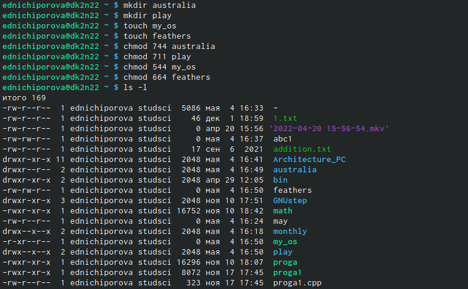

---
## Front matter
title: "Лабораторная работа №5"
subtitle: "Операционные системы"
author: "Ничипорова Елена Дмитриевна"

## Generic otions
lang: ru-RU
toc-title: "Содержание"

## Bibliography
bibliography: bib/cite.bib
csl: pandoc/csl/gost-r-7-0-5-2008-numeric.csl

## Pdf output format
toc: true # Table of contents
toc-depth: 2
lof: true # List of figures
lot: true # List of tables
fontsize: 12pt
linestretch: 1.5
papersize: a4
documentclass: scrreprt
## I18n polyglossia
polyglossia-lang:
  name: russian
  options:
	- spelling=modern
	- babelshorthands=true
polyglossia-otherlangs:
  name: english
## I18n babel
babel-lang: russian
babel-otherlangs: english
## Fonts
mainfont: PT Serif
romanfont: PT Serif
sansfont: PT Sans
monofont: PT Mono
mainfontoptions: Ligatures=TeX
romanfontoptions: Ligatures=TeX
sansfontoptions: Ligatures=TeX,Scale=MatchLowercase
monofontoptions: Scale=MatchLowercase,Scale=0.9
## Biblatex
biblatex: true
biblio-style: "gost-numeric"
biblatexoptions:
  - parentracker=true
  - backend=biber
  - hyperref=auto
  - language=auto
  - autolang=other*
  - citestyle=gost-numeric
## Pandoc-crossref LaTeX customization
figureTitle: "Рис."
tableTitle: "Таблица"
listingTitle: "Листинг"
lofTitle: "Список иллюстраций"
lotTitle: "Список таблиц"
lolTitle: "Листинги"
## Misc options
indent: true
header-includes:
  - \usepackage{indentfirst}
  - \usepackage{float} # keep figures where there are in the text
  - \floatplacement{figure}{H} # keep figures where there are in the text
---

# Цель работы

Ознакомление с файловой системой Linux, её структурой, именами и содержанием
каталогов. Приобретение практических навыков по применению команд для работы
с файлами и каталогами, по управлению процессами (и работами), по проверке использования диска и обслуживанию файловой системы.

# Выполнение лабораторной работы

- Выполняю все примеры, приведенные в первой части описания лабораторной работы 
- Выполняю примеры из пункта 5.2.2 (рис.1)(рис. [-@fig:001])

{ #fig:001 width=70% }
- Выполняю примеры из пункта 5.2.3 (рис.2)(рис. [-@fig:002])

{ #fig:002 width=70% }
- Выполняю примеры из пункта 5.2.5 (рис.3) (рис. [-@fig:003])

{ #fig:003 width=70% }

- После выполнения примеров, делаю следующие задания:Скопируйте файл /usr/include/sys/io.h в домашний каталог и назовите его
equipment. Если файла io.h нет, то используйте любой другой файл в каталоге
/usr/include/sys/ вместо него; в домашнем каталоге создайте директорию ~/ski.plases; переместите файл equipment в каталог ~/ski.plases; переименуйте файл ~/ski.plases/equipment в ~/ski.plases/equiplist; создайте в домашнем каталоге файл abc1 и скопируйте его в каталог
~/ski.plases, назовите его equiplist2; Ссоздайте каталог с именем equipment в каталоге ~/ski.plases;переместите файлы ~/ski.plases/equiplist и equiplist2 в каталог
~/ski.plases/equipment; создайте и переместите каталог ~/newdir в каталог ~/ski.plases и назовите его plans.(рис. 4)(рис. [-@fig:004])

{ #fig:004 width=70% }
- Далеесозданю необходимы файлы. Определяю опции командой chmod, необходимые для того, чтобы присвоить перечисленным в задании файлам выделенные права доступа, считая, что в начале таких прав нет (рис.5)(рис. [-@fig:005])

{ #fig:005 width=70% }
- Проделываю следующие действия: 
- Просмотрите содержимое файла /etc/password.(рис.6)(рис. [-@fig:006])

{ #fig:006 width=70% }
- Скопируйте файл ~/feathers в файл ~/file.old;переместите файл ~/file.old в каталог ~/play;скопируйте каталог ~/play в каталог ~/fun;переместите каталог ~/fun в каталог ~/play и назовите его games.(рис.7)(рис. [-@fig:007])

{ #fig:007 width=70% }
- Лишите владельца файла ~/feathers права на чтение и смотрю, что произойдет при попытке просмотреть или скопировать этот файл(рис.8)(рис. [-@fig:008])

{ #fig:008 width=70% }

- Лишите владельца каталога ~/play права на выполнение, а потом заново их даем(рис.9)(рис. [-@fig:009])

{ #fig:009 width=70% }

- Читаю man по командам mount, fsck, mkfs, kill (рис. [-@fig:0010])

{ #fig:0010 width=70% } 
(рис. [-@fig:0011])

{ #fig:0011 width=70% }
(рис. [-@fig:0012])

{ #fig:0012 width=70% }
(рис. [-@fig:0013])

{ #fig:0013 width=70% }

# Выводы

В ходе данной лабораторной работы я ознакомилась с файловой системой Linux, её структурой, именами и содержанием
каталогов, приобрела практические навыки по применению команд для работы
с файлами и каталогами, по управлению процессами (и работами), по проверке использования диска и обслуживанию файловой системы.

# Список литературы{.unnumbered}

::: {#refs}
:::
