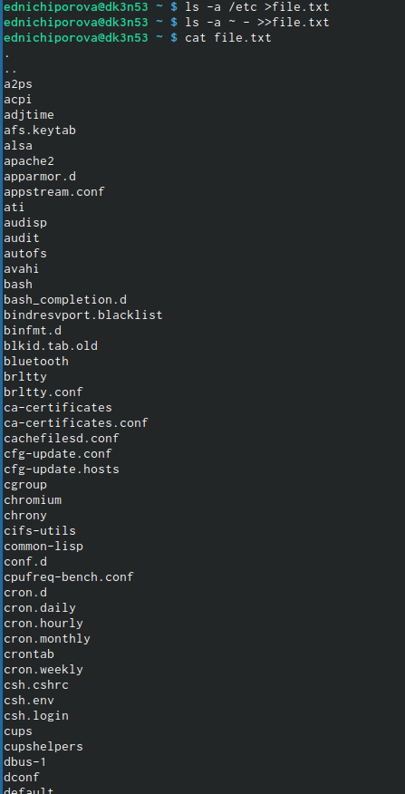
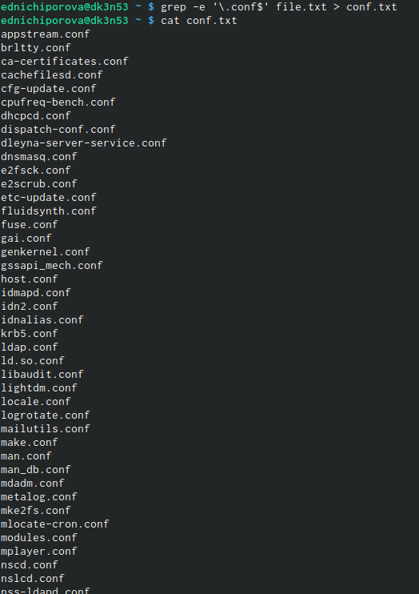
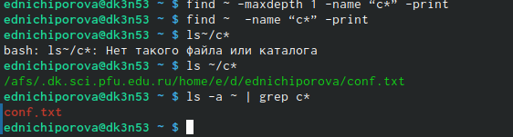
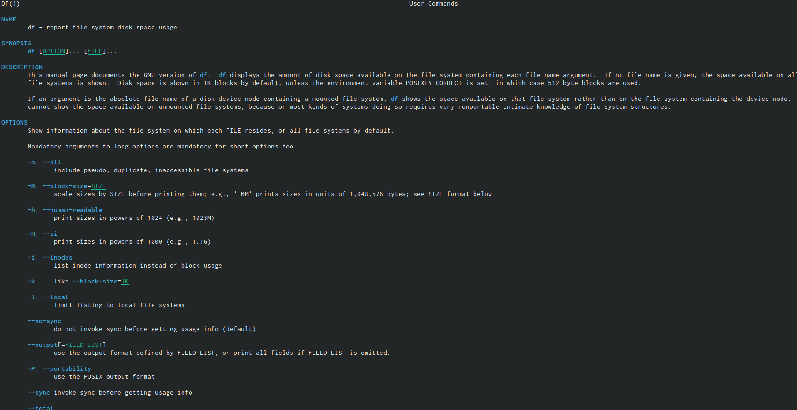
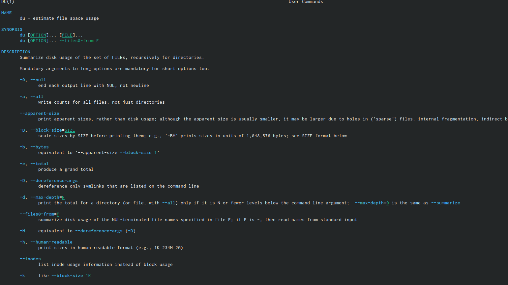
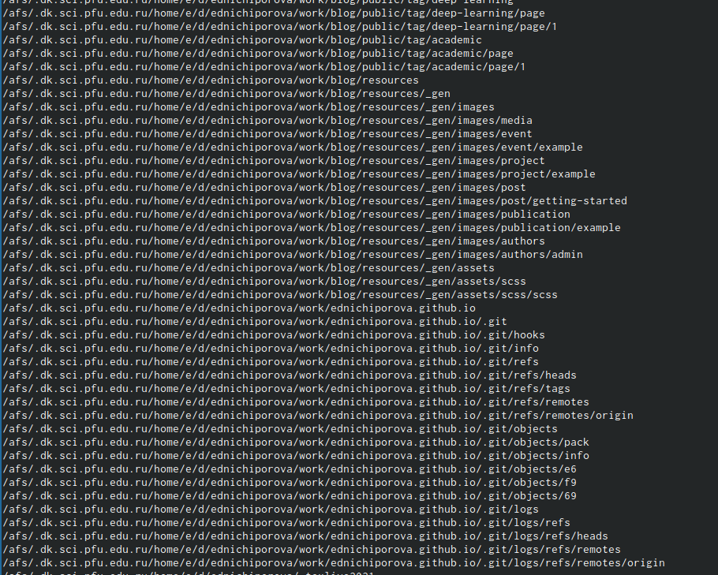

---
## Front matter
lang: ru-RU
title: Отчет по лабораторной работе №6
author: |
	Ничипорова Елена
institute: |
	РУДН,Москва
date: 5-05-22

## Formatting
toc: false
slide_level: 2
theme: metropolis
header-includes: 
 - \metroset{progressbar=frametitle,sectionpage=progressbar,numbering=fraction}
 - '\makeatletter'
 - '\beamer@ignorenonframefalse'
 - '\makeatother'
aspectratio: 43
section-titles: true
---

# Отчет 

## Цель работы

Ознакомление с инструментами поиска файлов и фильтрации текстовых данных.Приобретение практических навыков: по управлению процессами (и заданиями), попроверке использования диска и обслуживанию файловых систем.

## Выполнение

Записала в файл file.txt название файлов, содержащихся в определенном каталоге, далее дописываю названия файлов, содержащихся в домашнем каталогею просматриваю файл, чтобы убедиться в правильности действий(рис. [-@fig:001])

{ #fig:001 width=70% }

## Выполнение

Вывела имена всех файлов из file.txt, имеющих расширение .conf и записала их в новый текстовый файл.(рис. [-@fig:002])

{ #fig:002 width=70% }
- Определяю, какие файлы в домашнем каталоге имеют имена, начинающиеся с символа с несколькими командами(рис. [-@fig:003])

{ #fig:003 width=70% }

## Выполнение

Вывожу на экран файлы из каталога /etc , начинающиеся с символа h(рис. [-@fig:004])

{ #fig:004 width=70% }
- Запускаю в фоновом режиме процесс, который будет записывать в файл ~/logfile файлы, имена которых начинаются с log. Так как в фоновом режиме запустился беспрерывный процесс записывания файла, я сделала скриншот некоторой его части.

## Выполнение

- Запуская редактор gedit в фоновом режиме. После этого на экране появляется окно редактора(рис. [-@fig:007])

{ #fig:007 width=70% }
- Определяю идентификатор процесса gedit

## Выполнение

-С помощью команд "man df" "man du" узнаю информацию по необходимым командам и далее использую ее(рис. [-@fig:009])

{ #fig:009 width=70% }

## Выполнение

- df -улита, показывающая список всех файловых систем по именам устройств, сообщает их размер, занятое и свободное пространство и точки монтирования(рис. [-@fig:0010])

{ #fig:0010 width=70% }

- du- улита, предназначенная для вывода информации об объеме дискового пространства, занятого файлами и директориями(рис. [-@fig:0011])

{ #fig:0011 width=70% }

## Выпонение
- Вывела имена всех директорий, имеющихся в домашнем каталоге с помощью команды "find ~ -type d", предварительно получив информацию с помощью команды "man kill"(рис. [-@fig:0012])

{ #fig:0012 width=70% }

## Вывод
В ходе выполнения данной лабораторной работы я изучила инструменты поиска файлови фильтрации текстовых данных, а также приобрела практические навыки: по управлению процессами (и заданиями), по проверке использования диска и обслуживанию файловых систем.

## {.standout}

Wer's nicht glaubt, bezahlt einen Taler
