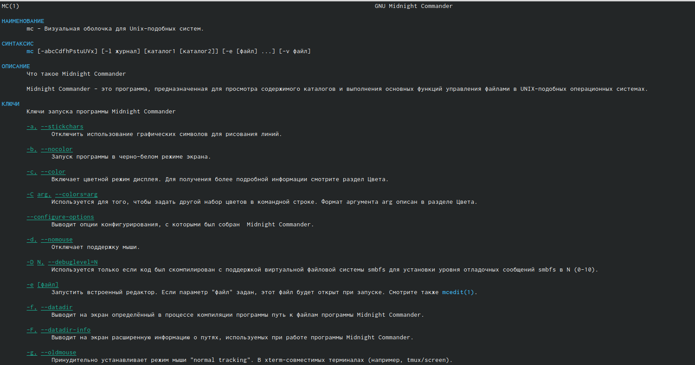
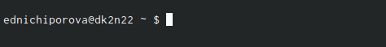

---
## Front matter
lang: ru-RU
title: Отчет по лабораторной работе №7
author: |
	Ничипорова Елена
institute: |
	РУДН, Москва
date: 11-05-22

## Formatting
toc: false
slide_level: 2
theme: metropolis
header-includes: 
 - \metroset{progressbar=frametitle,sectionpage=progressbar,numbering=fraction}
 - '\makeatletter'
 - '\beamer@ignorenonframefalse'
 - '\makeatother'
aspectratio: 43
section-titles: true
---

# Отчет

## Цель работы

Освоение основных возможностей командной оболочки Midnight Commander. Приоб-
ретение навыков практической работы по просмотру каталогов и файлов; манипуляций
с ними.

## Выполнение

- Изучила информацию о mc, вызвав командной строкой man mc. Узнала, что mc -это псевдографическая командная оболочка для систем(рис. [-@fig:001])

{ #fig:001 width=70% }

## Выполнение

- Запустила из командной строки mc, изучила его структуру и меню. В стандартном состоянии окно редактора состоит из двух панелей. Верхнее меню содержет меню "Левая панель", "Файл", "Команда", "Настройки", "Правая панель"
- Выполнила несколько пераций в mc, используя управляющие клавиши:выделение файлов (клавиша insert), копирование файлов (клавиша F5), перемещение файлов(клавиша F6)

## Выполнение

- Выполняю основные команды меню правой панели:"Список файлов" отображает размер файла и время его правки, "Быстрый просмотр" нужен для предпросмотра содержания файла, "Информация" отображает данные о файле,"Дерево" необходим для просмотра дерева каталога, "Выбор кодировки" нужен для просмотра и смены кодировки.

- Вызвала меню настройки. Освоила операции, определяющие структуру экрана mc: конфигурация - позволяет скорректировать настройки работы с панелями; внешний вид и настройки панелей определяют элементы, отображаемые при вызове mc, а также геометрию расположения панелей и цветовыделение; биты символов - задает формат обработки информации локальным термиалом; оформление - позволяет менять цвет визуальной оболочки.

## Выполнение

- создаю текстовый файл text.txt и открываю этот файл с помощью встроенного в mc редактора. Вставляем любой текст из Интернета

## Выполнение

- Далее проделываем с текстом следующие действия: удаляем строку с помощью клавиши F8, выделяем фрагмент текста с помощью клавиши F3 и копируем его на новую строку(F6), сохраняем файл клавишей F2.Отменяем последнее действие с помощью комбинации ctri+u
- Переходим в конец файла(ctrl+end) и пишем "всем привет".Переходим в начало(ctrl+home) и пишем то же самое.Сохраняем файл и выходим из него.

## Выполнение
- Используя меню редактора, выключила подсветку синтаксиса(рис. [-@fig:002])

{ #fig:002 width=70% }

## Вывод
- Я освоила основные возможности командной оболочки Midnight Commander. Приобрела навыки практической работы по просмотру каталогов и файлов, научилась манипуляции с ними.

## {.standout}

Wer's nicht glaubt, bezahlt einen Taler
