---
## Front matter
title: "Отчет по лабораторной работе №7"
subtitle: "Операционные системы"
author: "Ничипорова Елена Дмитриевна"

## Generic otions
lang: ru-RU
toc-title: "Содержание"

## Bibliography
bibliography: bib/cite.bib
csl: pandoc/csl/gost-r-7-0-5-2008-numeric.csl

## Pdf output format
toc: true # Table of contents
toc-depth: 2
lof: true # List of figures
lot: true # List of tables
fontsize: 12pt
linestretch: 1.5
papersize: a4
documentclass: scrreprt
## I18n polyglossia
polyglossia-lang:
  name: russian
  options:
	- spelling=modern
	- babelshorthands=true
polyglossia-otherlangs:
  name: english
## I18n babel
babel-lang: russian
babel-otherlangs: english
## Fonts
mainfont: PT Serif
romanfont: PT Serif
sansfont: PT Sans
monofont: PT Mono
mainfontoptions: Ligatures=TeX
romanfontoptions: Ligatures=TeX
sansfontoptions: Ligatures=TeX,Scale=MatchLowercase
monofontoptions: Scale=MatchLowercase,Scale=0.9
## Biblatex
biblatex: true
biblio-style: "gost-numeric"
biblatexoptions:
  - parentracker=true
  - backend=biber
  - hyperref=auto
  - language=auto
  - autolang=other*
  - citestyle=gost-numeric
## Pandoc-crossref LaTeX customization
figureTitle: "Рис."
tableTitle: "Таблица"
listingTitle: "Листинг"
lofTitle: "Список иллюстраций"
lotTitle: "Список таблиц"
lolTitle: "Листинги"
## Misc options
indent: true
header-includes:
  - \usepackage{indentfirst}
  - \usepackage{float} # keep figures where there are in the text
  - \floatplacement{figure}{H} # keep figures where there are in the text
---

# Цель работы

Освоение основных возможностей командной оболочки Midnight Commander. Приоб-
ретение навыков практической работы по просмотру каталогов и файлов; манипуляций
с ними.

# Выполнение лабораторной работы

- Изучила информацию о mc, вызвав командной строкой man mc. Узнала, что mc -это псевдографическая командная оболочка для систем(рис. [-@fig:001])

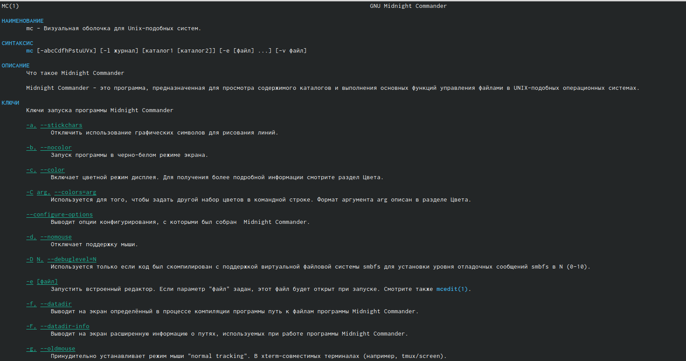{ #fig:001 width=70% }

- Запустила из командной строки mc, изучила его структуру и меню. В стандартном состоянии окно редактора состоит из двух панелей. Верхнее меню содержет меню "Левая панель"(рис. [-@fig:002]), "Файл"(рис. [-@fig:003]), "Команда"(рис. [-@fig:004]), "Настройки"(рис. [-@fig:005]), "Правая панель"(рис. [-@fig:006])

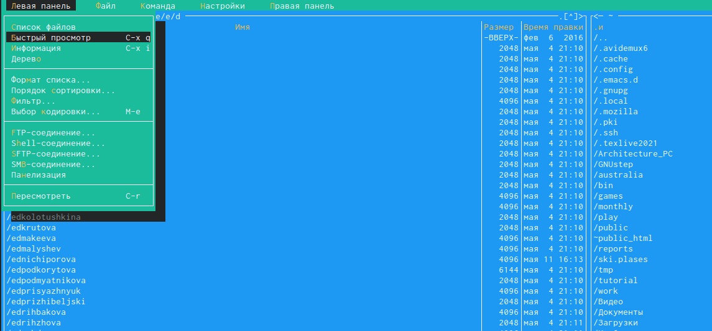{ #fig:002 width=70% }

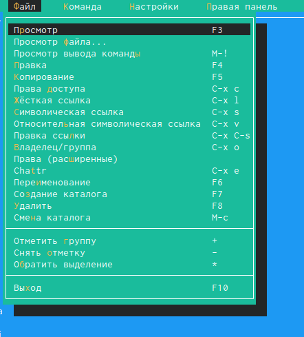{ #fig:003 width=70% }

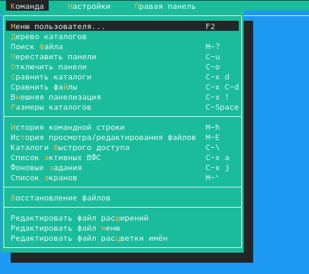{ #fig:004 width=70% }

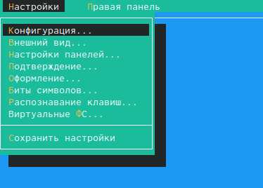{ #fig:005 width=70% }

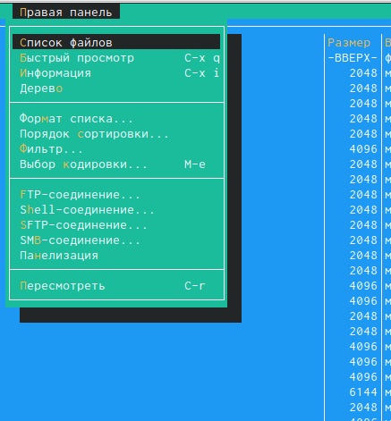{ #fig:006 width=70% }

- Выполнила несколько операций в mc, используя управляющие клавиши

- Выделение файлов (клавиша insert). Для выделения файлов или его отмены можно использовать команды "Снять отметку", "Обратить выделение" в мен. файл

- Для копировани файлов используется клавиша F5(рис. [-@fig:007])

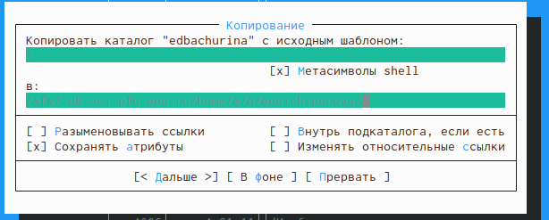{ #fig:007 width=70% }

- Для перемещения файлов используется клавиша F6(рис. [-@fig:008])

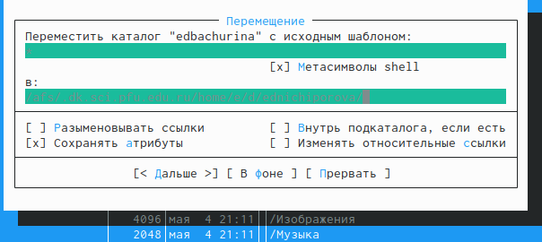{ #fig:008 width=70% }

- Для получения информации можно перейти в "Левая панель"->"Информация"
- "Левая панель"->"Формат списка"->"Расширенный"
- "Файл"->"права".Помимо названия файла или каталога выводит сведения о правах доступа, владельце, группе, времени правки(рис. [-@fig:009])

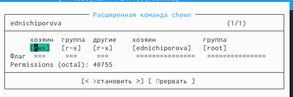{ #fig:009 width=70% }

- Выполняю основные команды меню правой панели:"Список файлов" отображает размер файла и время его правки(рис. [-@fig:0010]), "Быстрый просмотр" нужен для предпросмотра содержания файла, "Информация" отображает данные о файле(рис. [-@fig:0011]),"Дерево" необходим для просмотра дерева каталога(рис. [-@fig:0012]), "Выбор кодировки" нужен для просмотра и смены кодировки.

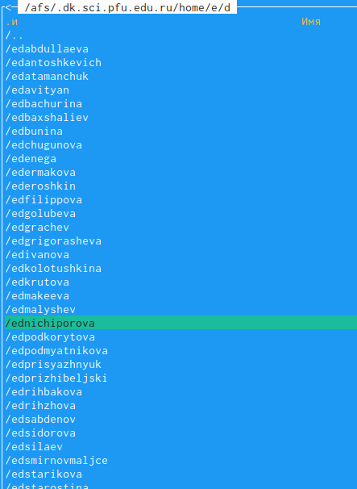{ #fig:0010 width=70% }

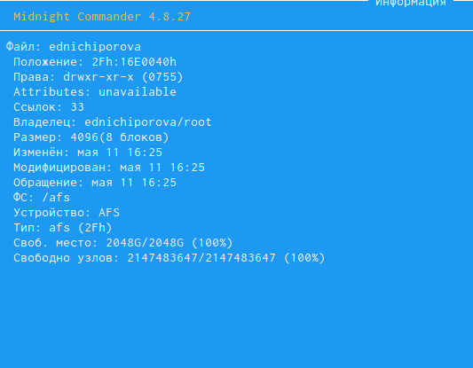{ #fig:0011 width=70% }

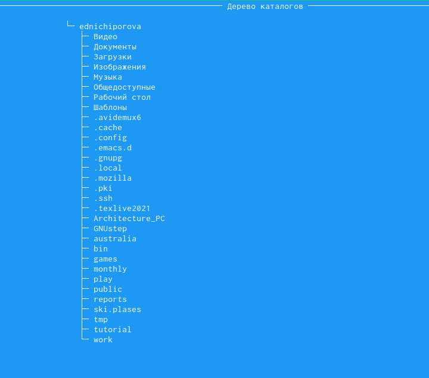{ #fig:0012 width=70% }

- Используя возможности подменю "Файл" выполняю: просмотр и редактирование текстового файла(рис. [-@fig:0013]), создание каталога, копирование файлов в созданный каталог (новый созданный каталог abc)(рис. [-@fig:0014])
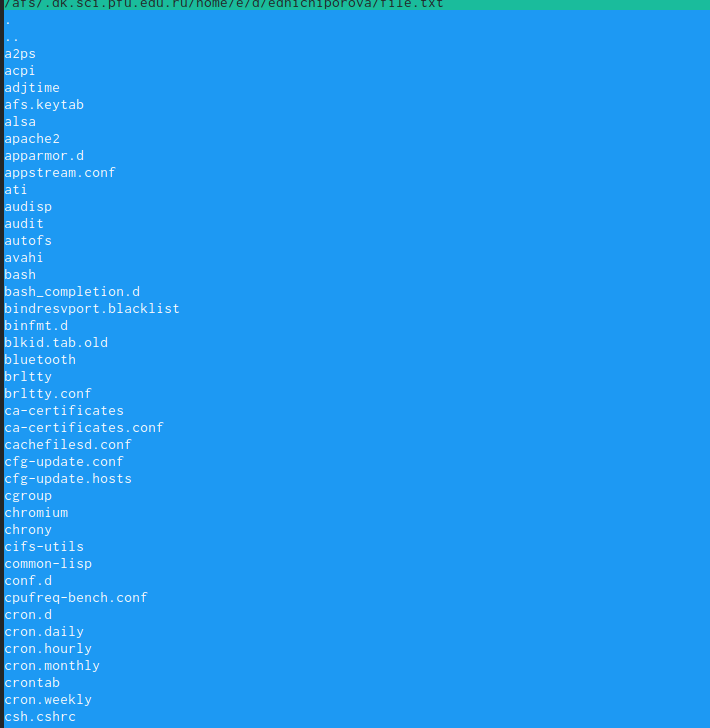{ #fig:0013 width=70% }

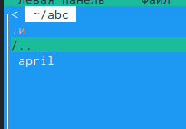{ #fig:0014 width=70% }

- с помощью соответствующих средств подменю "Команда" осуществила: поиск в файловой системе файла с заданными условиями(рис. [-@fig:0015])

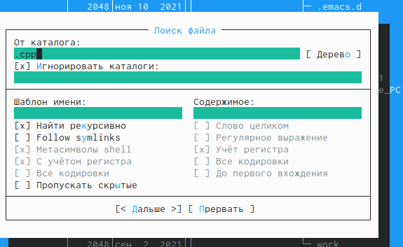{ #fig:0015 width=70% }

- Выбор и повторение одной из предыдущих команд. Перешла в пункт "история" командной строки и увидела, что появилась строка история, но она пустая, потому что командная строка не была использована

- Перешла в домашний каталог с помощью Дерева каталогов(рис. [-@fig:0016])

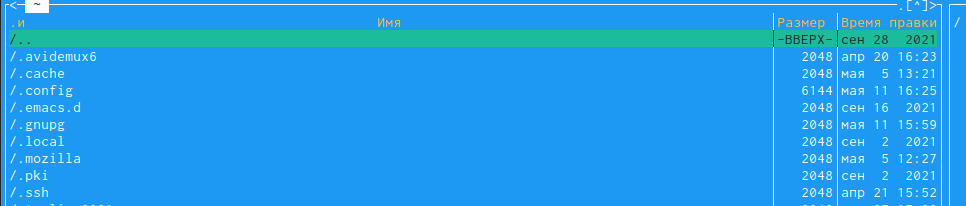{ #fig:0016 width=70% }

- Вызвала меню настройки. Освоила операции, определяющие структуру экрана mc: конфигурация - позволяет скорректировать настройки работы с панелями; внешний вид и настройки панелей определяют элементы, отображаемые при вызове mc, а также геометрию расположения панелей и цветовыделение; биты символов - задает формат обработки информации локальным термиалом; оформление - позволяет менять цвет визуальной оболочки.

- Задание по встроенному редактору mc

- создаю текстовый файл text.txt(рис. [-@fig:0017])

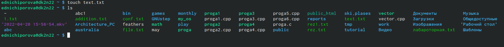{ #fig:0017 width=70% }

- открываю этот файл с помощью встроенного в mc редактора(рис. [-@fig:0018])

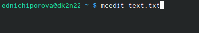{ #fig:0018 width=70% }

- вставляем текст(рис. [-@fig:0019])

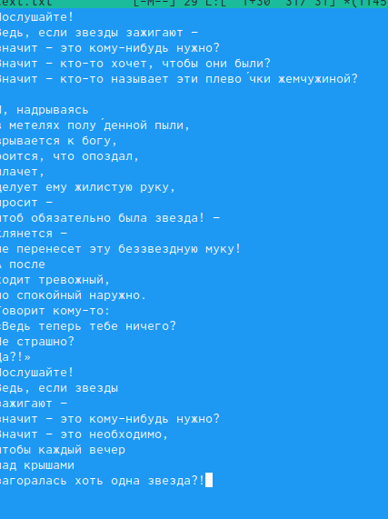{ #fig:0019 width=70% }

- далее проделываем с текстом следующие действия: удаляем строку с помощью клавиши F8(рис. [-@fig:0020]), выделяем фрагмент текста с помощью клавиши F3 и копируем его на новую строку(F6)(рис. [-@fig:0021]), сохраняем файл клавишей F2.Отменяем последнее действие с помощью комбинации ctri+u
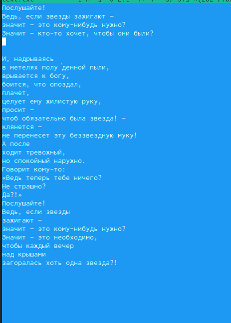{ #fig:0020 width=70% }

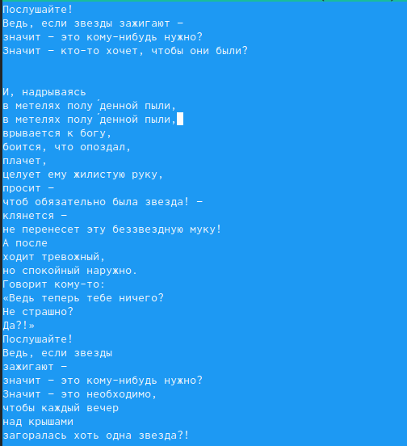{ #fig:0021 width=70% }

- Переходим в конец файла(ctrl+end) и пишем "всем привет".Переходим в начало(ctrl+home) и пишем то же самое(рис. [-@fig:0022]).Сохраняем файл и выходим из него.

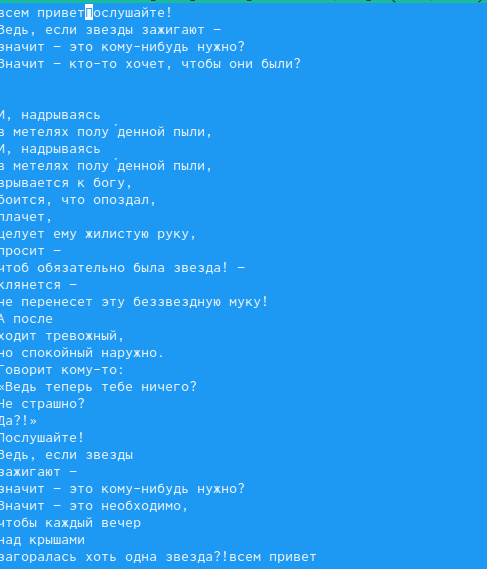{ #fig:0022 width=70% }

- Используя меню редактора, выключила подсветку синтаксиса(рис. [-@fig:0023])

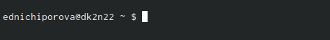{ #fig:0023 width=70% }
# Выводы

Я освоила основные возможности командной оболочки Midnight Commander. Приобрела навыки практической работы по просмотру каталогов и файлов, научилась манипуляции с ними.

# Список литературы{.unnumbered}

::: {#refs}
:::
