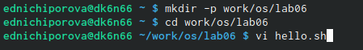
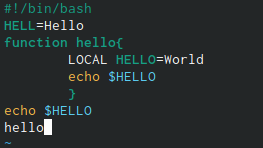
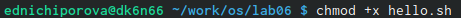
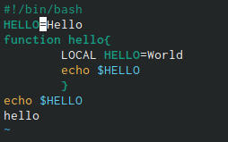

---
## Front matter
lang: ru-RU
title: Отчет по лпбораторной работе №8
author: |
	Ничипорова Елена
institute: |
	РУДН,Москва
date: 12-05-22

## Formatting
toc: false
slide_level: 2
theme: metropolis
header-includes: 
 - \metroset{progressbar=frametitle,sectionpage=progressbar,numbering=fraction}
 - '\makeatletter'
 - '\beamer@ignorenonframefalse'
 - '\makeatother'
aspectratio: 43
section-titles: true
---

# Отчет

## Цель

- Познакомиться с операционной системой Linux.Получить практические навыки рабо-ты с редактором vi,установленным по умолчанию практически во всех дистрибутивах.

## Выполнение

- Создаем каталог с именем ~/work/os/lab06 и переходим в него.Вызвала vi и создала файл hello.sh(рис. [-@fig:001])

{ #fig:001 width=70% }

## Выполнение

- Нажимаем клавишу i и вводим текст, представленный в лабораторной работе(рис. [-@fig:002])

{ #fig:002 width=70% }

## Выполнение

- Нажмите клавишу Esc для перехода в командный режим после завершения ввода текста.Нажмите : для перехода в режим последней строки и внизу вашего экрана появится приглашение в виде двоеточия.Нажмите w (записать) и q (выйти),а затем нажмите клавишу Enter для сохранения вашего текста и завершения работы.

- Делаем файл исполняемым(рис. [-@fig:003])

{ #fig:003 width=70% }

## Выполнение

- Вызываем vi на редактирования файла

-  Далее с помощью стрелок установила курсор в конец слова HELL второй строки 

- Перешла в режим вставки, нажав на клавишу «i», и заменила HELL на HELLO, дописав O. Нажала «esc» для возврата в командный режим(рис. [-@fig:004])

{ #fig:004 width=70% }

## Выполнение

- С помощью стрелок установила курсор на четвертую строку и стёрла слово LOCAL с помощью комбинации клавиш «d» (delete) и «w» (word)

- Перешла в режим вставки, нажав клавишу «i», и набрала следующий текст: local. Нажала «esc» для возврата в командный режим 

## Выполнение

- Установила курсор на последней строке файла, используя стрелки. Вставила после неё строку, содержащую следующий текст: echo $HELLO

- Далее нажала «esc», чтобы перейти в командный режим.

- Удаляем последнюю строку

## Выполнение

- Ввела команду отмены изменений «u» для отмены последней команды

- Ввела символ «:» для перехода в режим последней строки. Записала произведённые изменения, нажав «w» и «q» и вышла из vi 

## Вывод

В ходе лабораторной работы я познакомилась с операционной системой Linux. Получила практические навыки работы с редактором vi, установленным по умолчанию практически во всех дистрибутивах.

## {.standout}

Wer's nicht glaubt, bezahlt einen Taler
