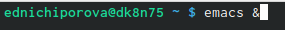
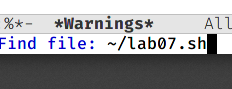
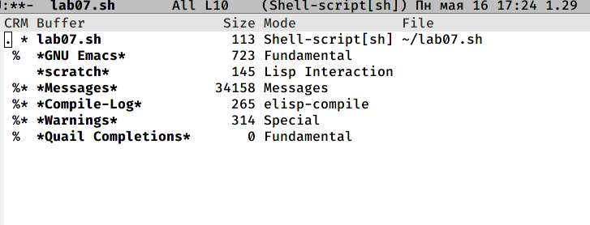
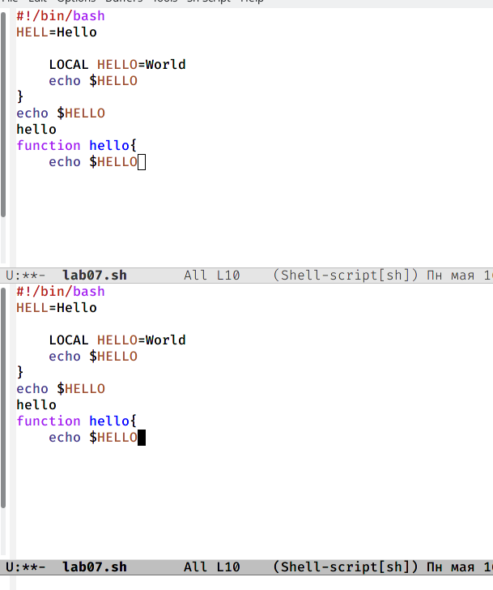
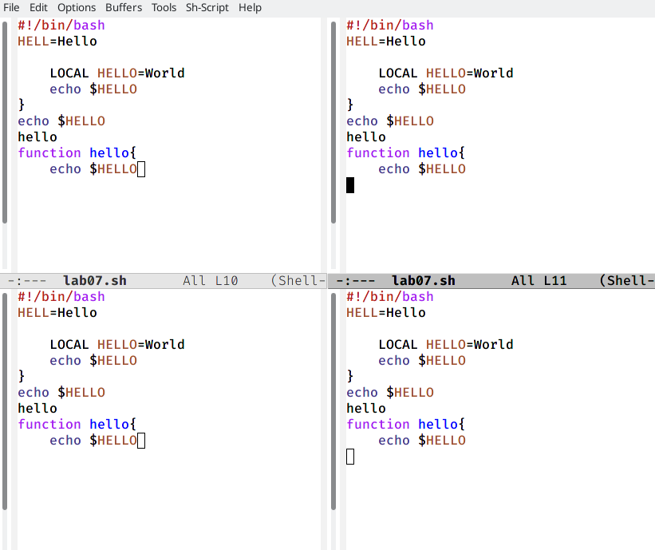
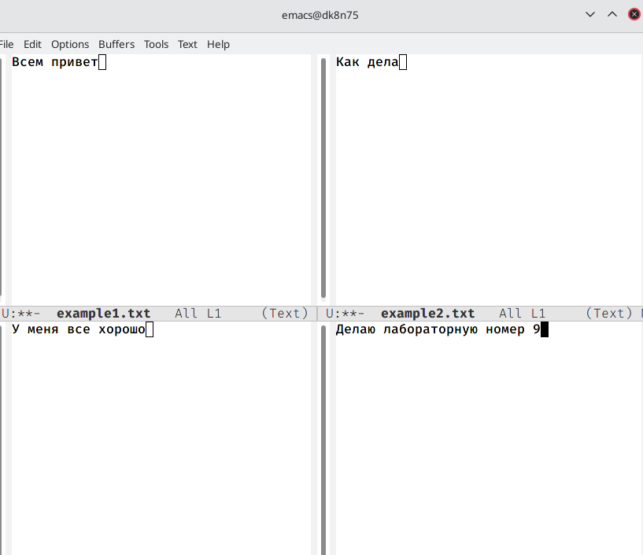
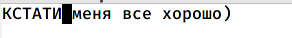

---
## Front matter
lang: ru-RU
title: Отчет по лабораторной работе № 9
author: |
	Ничипорова Елена
institute: |
	РУДН,Москва
date: 16-05-22

## Formatting
toc: false
slide_level: 2
theme: metropolis
header-includes: 
 - \metroset{progressbar=frametitle,sectionpage=progressbar,numbering=fraction}
 - '\makeatletter'
 - '\beamer@ignorenonframefalse'
 - '\makeatother'
aspectratio: 43
section-titles: true
---

# Отчет

## Цель

Познакомиться с операционной системой Linux.Получить практические навыки рабо-ты с редактором Emacs.

## Выполнение

- Открывае emacs (рис. [-@fig:001]) 

{ #fig:001 width=70% }

## Выполнение

- Создаем файл lab07.sh с помощью комбинации ctrl-x ctri-f(рис. [-@fig:002])

{ #fig:002 width=40% }

## Выполнение

- Набираем текст(рис. [-@fig:003]). Сохраняем файл с помощью комбинации ctri-x ctrl-s

{ #fig:003 width=40% }

## Выполнение

- Проделываем следующие манипуляции с текстом: вырезаем командой ctrl-k целую строку, вставляем эту строку в конец текста командой ctrl-y, выделяем область текста командой ctrl-spase, копируем в буфер обмена область с помощью команды alt-w, вставляем в конец текста, вновь выделяем эту область и вырезаем ее командой ctrl-w, отменяем последнее действие командой ctrl-/

## Выполнение

- Учимся использовать команды по перемещению курсора: переместили в начало строки командой ctrl-a, в конец строки командой ctrl-e, в начало буфера командой alt-<, в конец буфера командой ait->

## Выполнение

- Вывела список активных буферов командой ctrl-x ctrl-b(рис. [-@fig:004])

{ #fig:004 width=40% }

## Выполнение

- Переместилась в открытое окно и переключилась на другой буфер командой ctrl-x(рис. [-@fig:005]). Закрыла окно командой ctrl-x 0. Переключилась между буферами, но уже без вывода их на экран командой ctrl-x b

{ #fig:005 width=40% }

## Выполнение
- - Разделила экран на 4 части(рис. [-@fig:006]). Создаем новые текстовые документы и открываем их в окне

{ #fig:006 width=30% }

## Выполнение
Вводим несколько строчек текста(рис. [-@fig:007])

{ #fig:007 width=30% }

## Выполнение
- Переключаюсь в режим поиска командой ctrl-s. Затем выхожу из режима поиска командой ctrl-g(рис. [-@fig:008])

{ #fig:008 width=30% }

## Выполнение

- Переходим в режим замены командой alt-% и заменяем слово на другое(рис. [-@fig:009])

{ #fig:009 width=30% }

## Вывод
- В ходе выполнения данной лабораторной работы я познакомилась с операционной системой Linux и получила практические навыки работы с редактором Emacs.
