---
## Front matter
title: "Отчет по лабораторной работе №9"
subtitle: "Операционные системы"
author: "Ничипорова Елена Дмитриевна"

## Generic otions
lang: ru-RU
toc-title: "Содержание"

## Bibliography
bibliography: bib/cite.bib
csl: pandoc/csl/gost-r-7-0-5-2008-numeric.csl

## Pdf output format
toc: true # Table of contents
toc-depth: 2
lof: true # List of figures
lot: true # List of tables
fontsize: 12pt
linestretch: 1.5
papersize: a4
documentclass: scrreprt
## I18n polyglossia
polyglossia-lang:
  name: russian
  options:
	- spelling=modern
	- babelshorthands=true
polyglossia-otherlangs:
  name: english
## I18n babel
babel-lang: russian
babel-otherlangs: english
## Fonts
mainfont: PT Serif
romanfont: PT Serif
sansfont: PT Sans
monofont: PT Mono
mainfontoptions: Ligatures=TeX
romanfontoptions: Ligatures=TeX
sansfontoptions: Ligatures=TeX,Scale=MatchLowercase
monofontoptions: Scale=MatchLowercase,Scale=0.9
## Biblatex
biblatex: true
biblio-style: "gost-numeric"
biblatexoptions:
  - parentracker=true
  - backend=biber
  - hyperref=auto
  - language=auto
  - autolang=other*
  - citestyle=gost-numeric
## Pandoc-crossref LaTeX customization
figureTitle: "Рис."
tableTitle: "Таблица"
listingTitle: "Листинг"
lofTitle: "Список иллюстраций"
lotTitle: "Список таблиц"
lolTitle: "Листинги"
## Misc options
indent: true
header-includes:
  - \usepackage{indentfirst}
  - \usepackage{float} # keep figures where there are in the text
  - \floatplacement{figure}{H} # keep figures where there are in the text
---

# Цель работы

Познакомиться с операционной системой Linux.Получить практические навыки рабо-ты с редактором Emacs.

# Выполнение лабораторной работы

- Открывае emacs (рис. [-@fig:001]) (рис. [-@fig:002])

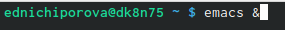{ #fig:001 width=70% }

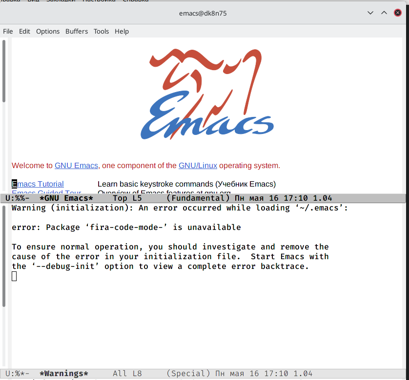{ #fig:002 width=70% }

- Создаем файл lab07.sh с помощью комбинации ctrl-x ctri-f(рис. [-@fig:003])

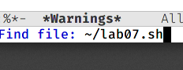{ #fig:003 width=70% }

- Набираем текст(рис. [-@fig:004])

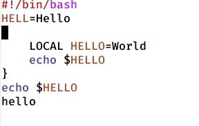{ #fig:004 width=70% }

- Сохраняем файл с помощью комбинации ctri-x ctrl-s

- Проделываем следующие манипуляции с текстом: вырезаем командой ctrl-k целую строку, вставляем эту строку в конец текста командой ctrl-y(рис. [-@fig:005]), выделяем область текста командой ctrl-spase(рис. [-@fig:006]), копируем в буфер обмена область с помощью команды alt-w, вставляем в конец текста(рис. [-@fig:007]), вновь выделяем эту область и вырезаем ее командой ctrl-w(рис. [-@fig:008]), отменяем последнее действие командой ctrl-/(рис. [-@fig:009])

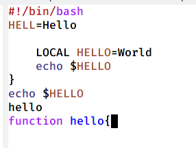{ #fig:005 width=70% }

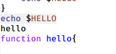{ #fig:006 width=70% }

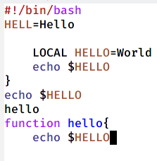{ #fig:007 width=70% }

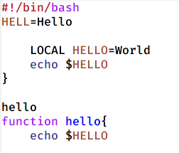{ #fig:008 width=70% }

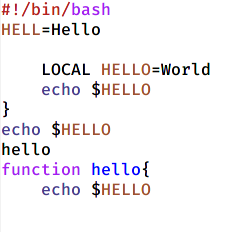{ #fig:009 width=70% }

- Учимся использовать команды по перемещению курсора: переместили в начало строки командой ctrl-a(рис. [-@fig:0010]), в конец строки командой ctrl-e(рис. [-@fig:0011]), в начало буфера командой alt-<(рис. [-@fig:0012]), в конец буфера командой ait->(рис. [-@fig:0013])

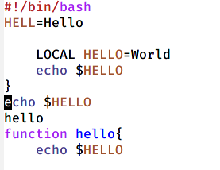{ #fig:0010 width=70% }

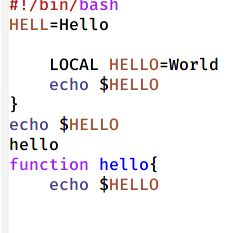{ #fig:0011 width=70% }

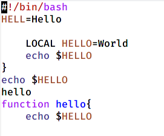{ #fig:0012 width=70% }

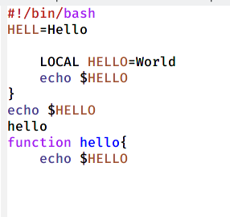{ #fig:0013 width=70% }

- Вывела список активных буферов командой ctrl-x ctrl-b(рис. [-@fig:0014])

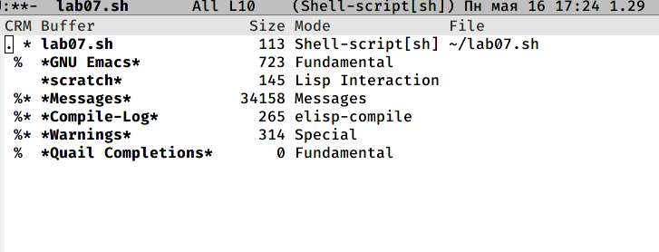{ #fig:0014 width=70% }

- Переместилась в открытое окно и переключилась на другой буфер командой ctrl-x(рис. [-@fig:0015]). Закрыла окно командой ctrl-x 0. Переключилась между буферами, но уже без вывода их на экран командой ctrl-x b

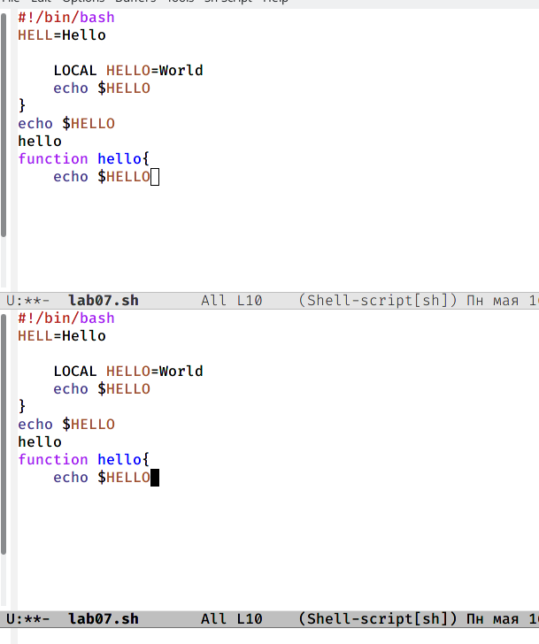{ #fig:0015 width=70% }

- Разделила экран на 4 части(рис. [-@fig:0016])

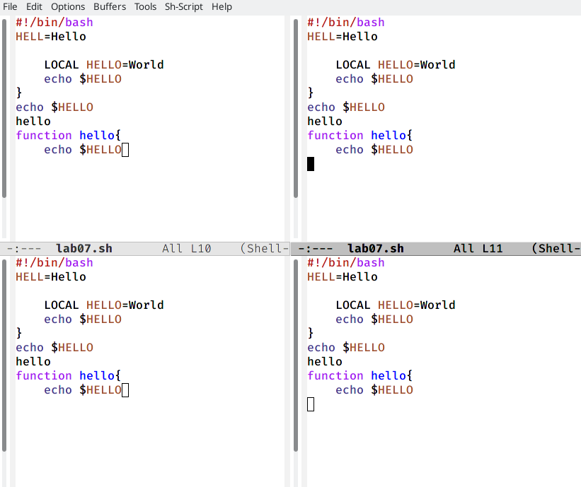{ #fig:0016 width=70% }

- Создаем новые текстовые документы и открываем их в окне(рис. [-@fig:0017])

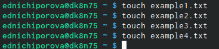{ #fig:0017 width=70% }

- Вводим несколько строчек текста(рис. [-@fig:0018])

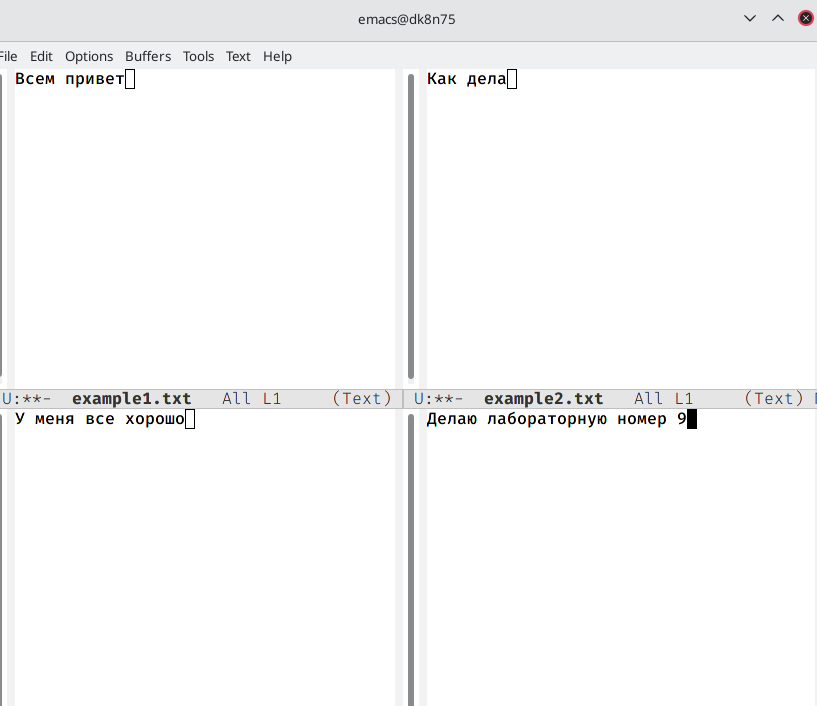{ #fig:0018 width=70% }

- Переключаюсь в режим поиска командой ctrl-s. Затем выхожу из режима поиска командой ctrl-g(рис. [-@fig:0019])

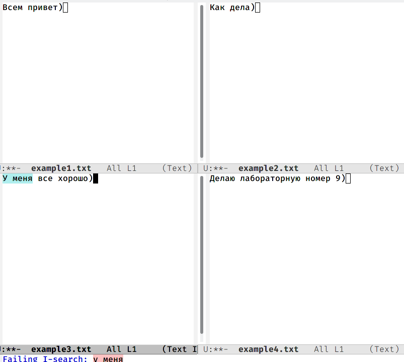{ #fig:0019 width=70% }

- Переходим в режим замены командой alt-% и заменяем слово на другое(рис. [-@fig:0020])

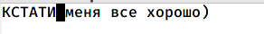{ #fig:0020 width=70% }

- Ответы на контрольные вопросы:

1). Emacs − один из наиболее мощных и широко распространённых редакторов, используемых в мире Unix. По популярности он соперничает с редактором vi и его клонами. В зависимости от ситуации, Emacs может быть текстовым редактором; программой для чтения почты и новостей Usenet; интегрированной средой разработки (IDE); операционной системой и т.д.Всё это разнообразие достигается благодаря архитектуре Emacs, которая позволяет расширять возможности редактора при помощи языка Emacs Lisp. На языке C написаны лишь самые базовые и низкоуровневые части Emacs, включая полнофункциональный. интерпретатор языка Lisp. Таким образом, Emacs имеет встроенный язык программирования, который может использоваться для настройки, расширения и изменения поведения редактора. В действительности, большая часть того редактора, с которым пользователи Emacs работают в наши дни,написана на языке Lisp.

2). Основную трудность для новичков при освоенииданного редактора могутсоставлять большое количество команд, комбинаций клавиш, которые не получится все запомнить с первого раза и поэтоупридется часто обращаться к справочным материалам.

3). Буфер –это объект, представляющий собой текст. Если имеется несколько буферов, то редактировать можно только один. Обычно буфер считывает данные из файла или записывает в файл данные из буфера.Окно –это область экрана, отображающая буфер. При запуске редактора отображается одно окно, но при обращении к некоторым функциям могут открыться дополнительные окна. Окна Emacsи окна графической среды XWindow–разные вещи. Одно окно XWindowможет быть разбито на несколько окон в смысле Emacs, в каждом из которых отображается отдельный буфер.

4). Да, можно.

5). При запуске Emacsпо умолчанию создаются следующие буферы: «scratch»(буфер для несохраненного текста) «Messages»(журнал ошибок, включающий такжеинформацию, которая появляется в области EchoArea) «GNUEmacs»(справочный буфер о редакторе).

6). C-c |сначала, удерживая «ctrl»,нажимаю «c»,после –отпускаюобе клавишии нажимаю «|» C-cC-|сначала, удерживая «ctrl»,нажимаю «с», после –отпускаю обе клавиши и, удерживая «ctrl», нажимаю «|».

7). Чтобы поделить окно на две части необходимо воспользоваться комбинацией «Ctrl-x 3»(по вертикали) или «Ctrl-x 2» (по горизонтали).

8). Настройки Emacsхранятся в файле .emacs.

9). По умолчанию клавиша «←» удаляет символперед курсором, нов редакторе её можно переназначить. Для этого необхдимоизменить конфигурацию файла .emacs.

10). Более удобным я считаю редактор emacs, потому чтов нем проще открывать другие файлы, можно использовать сразу несколько окон, нет «Командногорежима», «Режима ввода», «Режима командной строки», которые являются немного непривычными и в какой-то степени неудобным.

# Выводы

В ходе выполнения данной лабораторной работы я познакомилась с операционной системой Linux и получила практические навыки работы с редактором Emacs.

# Список литературы{.unnumbered}

::: {#refs}
:::
