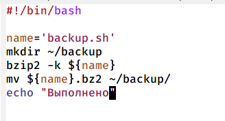
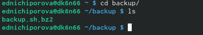
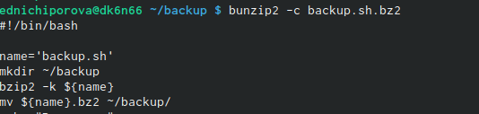
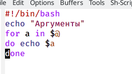
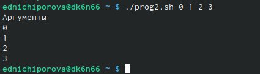
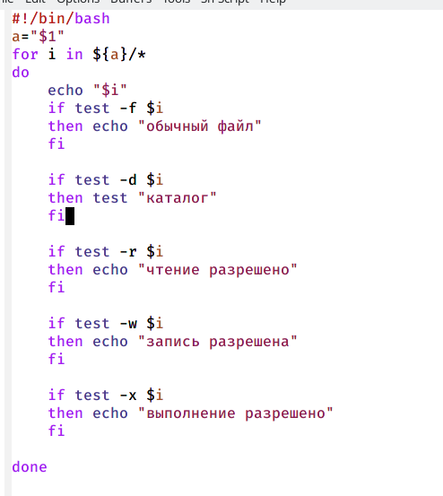
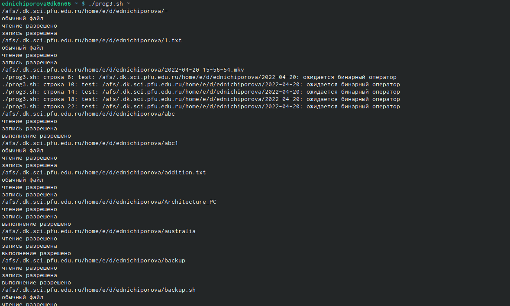

---
## Front matter
lang: ru-RU
title: Отчет по лабораторной работе №10
author: |
	Ничипорова Елена
institute: |
	РУДН,Москва
date: 18-05-22

## Formatting
toc: false
slide_level: 2
theme: metropolis
header-includes: 
 - \metroset{progressbar=frametitle,sectionpage=progressbar,numbering=fraction}
 - '\makeatletter'
 - '\beamer@ignorenonframefalse'
 - '\makeatother'
aspectratio: 43
section-titles: true
---

# Отчет

## Цель

- Изучить основы программирования в оболочке ОС UNIX/Linux. Научиться писать небольшие командные файлы.

## Выполнение

- Изучила команды архивации zib, bzip2, tar

- Создала файл, в котором будет первый скрипт, и открыла его в редакторе emacs, используя клавиши ctri-x ctrl-f

## Выполнение

- Написала скрипт, который при запуске будет делать резервную копию самого себя в другую директорию back up в нашем домашнем каталоге. При этом я использовала архиватор bzip2.(рис. [-@fig:001])

{ #fig:001 width=70% }

## Выполнение

 Проверила работу скрипта (команда "./backup.sh"), предварительно добавив на него право на выполнение (команда "chmod +x *.sh") . Скрипт работает корректно (рис. [-@fig:002]) (рис. [-@fig:003])

{ #fig:002 width=30% }

{ #fig:003 width=30% }

## Выполнение

- Создала файл, в котором буду писать второй скрипт. Открыла его в редакторе emacs.

- Написала пример командного файла, обрабатывающее любое произвольное число аргуметнов командной строки.(рис. [-@fig:004])

{ #fig:004 width=40% }

## Выполнение

- Проверила работу скрипта командой "prog2.sh 0 1 2 3". скрипт работает корректно(рис. [-@fig:005])

{ #fig:005 width=70% }

## Выполнение

- Написала командный файл -аналог команды ls.(рис. [-@fig:006])

{ #fig:006 width=70% }

## Выполнение

- Добавила права на выполнение скрипта и проверила его работу (команда "./prog3.sh ~"). Скрипт работает корректно(рис. [-@fig:007])

{ #fig:007 width=70% }

## Выполнение

- Написала командный файл, который получает в качестве аргумента команднойстроки формат файла (.txt, .doc, .jpg, .pdf и т.д.) и вычисляет количество такихфайлов в указанной директории. Путь к директории также передаётся в видеаргумента командной строки 

- Проверила работу скрипта (команда "./prog4.sh pdf sh txt doc"). Скрипт работает корректно.

## Вывод

- В ходе выполнения данной лабораторной работы я изучила основы программирования в оболочке ОС UNIX/Linux и научилась писать небольшие командные файлы.
