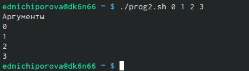

---
## Front matter
title: "Отчет по лабораторной работе №10"
subtitle: "Операционные системы"
author: "Ничипорова Елена Дмитриевна"

## Generic otions
lang: ru-RU
toc-title: "Содержание"

## Bibliography
bibliography: bib/cite.bib
csl: pandoc/csl/gost-r-7-0-5-2008-numeric.csl

## Pdf output format
toc: true # Table of contents
toc-depth: 2
lof: true # List of figures
lot: true # List of tables
fontsize: 12pt
linestretch: 1.5
papersize: a4
documentclass: scrreprt
## I18n polyglossia
polyglossia-lang:
  name: russian
  options:
	- spelling=modern
	- babelshorthands=true
polyglossia-otherlangs:
  name: english
## I18n babel
babel-lang: russian
babel-otherlangs: english
## Fonts
mainfont: PT Serif
romanfont: PT Serif
sansfont: PT Sans
monofont: PT Mono
mainfontoptions: Ligatures=TeX
romanfontoptions: Ligatures=TeX
sansfontoptions: Ligatures=TeX,Scale=MatchLowercase
monofontoptions: Scale=MatchLowercase,Scale=0.9
## Biblatex
biblatex: true
biblio-style: "gost-numeric"
biblatexoptions:
  - parentracker=true
  - backend=biber
  - hyperref=auto
  - language=auto
  - autolang=other*
  - citestyle=gost-numeric
## Pandoc-crossref LaTeX customization
figureTitle: "Рис."
tableTitle: "Таблица"
listingTitle: "Листинг"
lofTitle: "Список иллюстраций"
lotTitle: "Список таблиц"
lolTitle: "Листинги"
## Misc options
indent: true
header-includes:
  - \usepackage{indentfirst}
  - \usepackage{float} # keep figures where there are in the text
  - \floatplacement{figure}{H} # keep figures where there are in the text
---

# Цель работы

Изучить основы программирования в оболочке ОС UNIX/Linux. Научиться писать небольшие командные файлы.

# Выполнение лабораторной работы

- Изучила команды архивации (рис. [-@fig:001]) (рис. [-@fig:002]) (рис. [-@fig:003]) (рис. [-@fig:004])

{ #fig:001 width=70% }

{ #fig:002 width=40% }

{ #fig:003 width=40% }

{ #fig:004 width=40% }

- Создала файл, в котором будет первый скрипт, и открыла его в редакторе emacs, используя клавиши ctri-x ctrl-f(рис. [-@fig:005])

{ #fig:005 width=70% }

- Написала скрипт, который при запуске будет делать резервную копию самого себя в другую директорию back up в нашем домашнем каталоге. При этом я использовала архиватор bzip2.(рис. [-@fig:006])

{ #fig:006 width=70% }

- Проверила работу скрипта (команда "./backup.sh"), предварительно добавив на него право на выполнение (команда "chmod +x *.sh") (рис. [-@fig:007]). Скрипт работает корректно (рис. [-@fig:008]) (рис. [-@fig:009])

{ #fig:007 width=70% }

{ #fig:008 width=70% }

{ #fig:009 width=70% }

- Создала файл, в котором буду писать второй скрипт. Открыла его в редакторе emacs.

- Написала пример командного файла, обрабатывающее любое произвольное число аргуметнов командной строки.(рис. [-@fig:0010])

{ #fig:0010 width=70% }

- Добавила право на выпонение скрипта(рис. [-@fig:0011])

{ #fig:0011 width=70% }

- Проверила работу скрипта командой "prog2.sh 0 1 2 3". скрипт работает корректно(рис. [-@fig:0012])

{ #fig:0012 width=70% }

- Создала файл, в котором буду писать третий скрипт. Открыла его в редакторе emacs

- Написала командный файл -аналог команды ls.(рис. [-@fig:0013])

{ #fig:0013 width=70% }

- Добавила права на выполнение скрипта и проверила его работу (команда "./prog3.sh ~"). Скрипт работает корректно(рис. [-@fig:0014])

{ #fig:0014 width=70% }

- Создала файл для четвертого скрипта и открыла его в редакторе emacs(рис. [-@fig:0015])

{ #fig:0015 width=70% }

- Написала командный файл, который получает в качестве аргумента команднойстроки формат файла (.txt, .doc, .jpg, .pdf и т.д.) и вычисляет количество такихфайлов в указанной директории. Путь к директории также передаётся в видеаргумента командной строки (рис. [-@fig:0016])

{ #fig:0016 width=70% }

- Предварительно добавляю право на выполнение для него и создала дополнительные файлы с разным расширением(рис. [-@fig:0017])

{ #fig:0017 width=70% }

- Проверила работу скрипта (команда "./prog4.sh pdf sh txt doc"). Скрипт работает корректно.(рис. [-@fig:0018])

{ #fig:0018 width=70% }

# Выводы

В ходе выполнения данной лабораторной работы я изучила основы программирования в оболочке ОС UNIX/Linux и научилась писать небольшие командные файлы.

# Список литературы{.unnumbered}

::: {#refs}
:::
