---
## Front matter
lang: ru-RU
title: Отчет по лабораторной работе № 11
author: |
	Ничипорова Елена Дмитриевна
institute: |
	РУДН,Москва
date: 19-05-22

## Formatting
toc: false
slide_level: 2
theme: metropolis
header-includes: 
 - \metroset{progressbar=frametitle,sectionpage=progressbar,numbering=fraction}
 - '\makeatletter'
 - '\beamer@ignorenonframefalse'
 - '\makeatother'
aspectratio: 43
section-titles: true
---

# Отчет

## Цель

- Изучить основы программирования в оболочке ОС UNIX. Научится писать болеесложные командные файлы с использованиемлогических управляющих конструкцийи циклов

## Выполнение

- Используя команды getopts grep,написала командный файл,который анализирует командную строку с ключами:iinputfile—прочитатьданные из указанного файла;ooutputfile—вывести данные в указанный файл;pшаблон—указать шаблон для поиска;C—различать большие и малые буквы;n—выдавать номера строк.Для данной задачи создала фaйл prog1.sh(рис. [-@fig:001]) и написала следующие алгоритмы(рис. [-@fig:002])

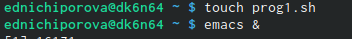{ #fig:001 width=30% }

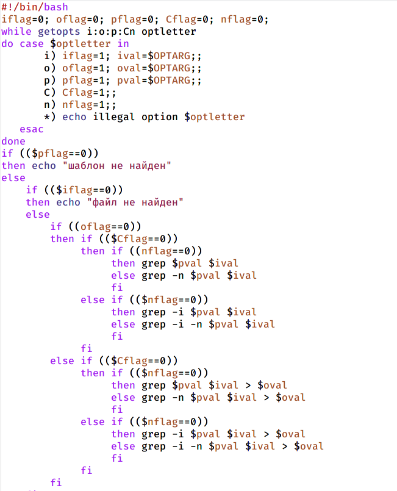{ #fig:002 width=20% }

## Выполнение

- проверила работу написанного скрипта, используя различные опции, предварительно добавив права на выполнение(рис. [-@fig:003]) и создав два файла, которые необходимы для выполнения программы. Скрипт работает корректно(рис. [-@fig:004])

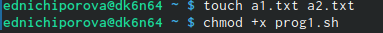{ #fig:003 width=30% }

{ #fig:004 width=30% }

## Выполнение

Написала на языке Си программу,которая вводит число и определяет,является ли оно больше нуля,меньше нуля или равно нулю.Затем программа завершается с помощью функции exit(n),передавая информацию в о коде завершения в оболочку.Командный файл должен вызывать эту программу и,проанализировав с помощью команды$?,выдать сообщение о том,какое число было введено.Для данной задачи я создала 2 файла(рис. [-@fig:005]) и написала соответствующие скрипты (рис. [-@fig:006])(рис. [-@fig:007])

{ #fig:005 width=30% }

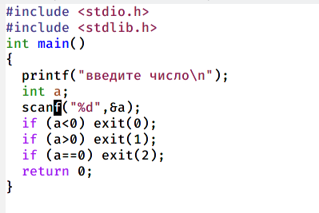{ #fig:006 width=30% }

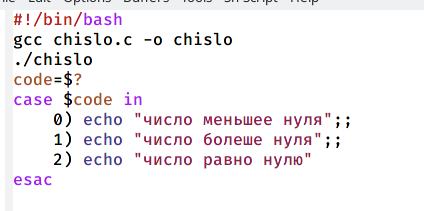{ #fig:007 width=30% }

## Выполнение

- Проверила работу написанных скриптов. Скрипты работаеют корректно(рис. [-@fig:008])

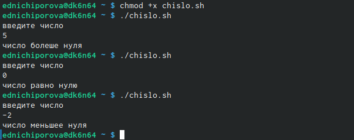{ #fig:008 width=30% }

## Выполнение

Написала командный файл,создающий указанное число файлов,пронумерованных последовательно от 1 до 𝑁(например1.tmp,2.tmp,3.tmp,4.tmpит.д.).Число файлов,которые необходимо создать,передаётся в аргументы командной строки.Этот же командный файл должен уметь удалять все созданные им файлы (если они существуют).Для данной задачи я создала новый файл (рис. [-@fig:009]) и написала соответсвующий скрипт(рис. [-@fig:0010])

{ #fig:009 width=30% }

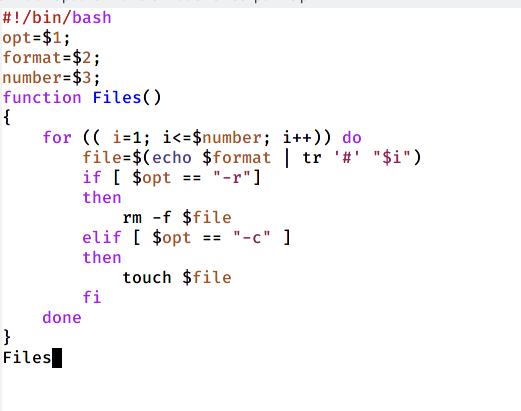{ #fig:0010 width=30% }

## Выполнение

- Прверила работу написанного скрипта, предварительно добавиви право на исполнение(рис. [-@fig:0011])

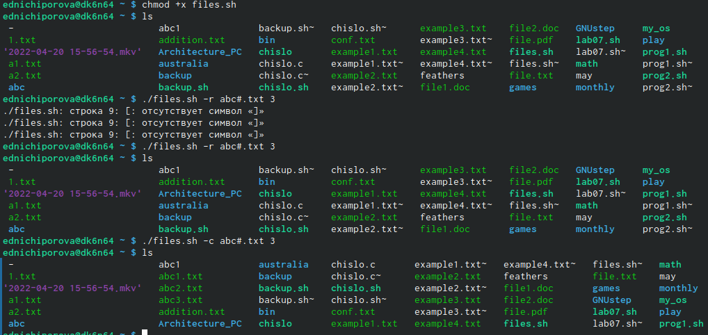{ #fig:0011 width=30% }

## Выполнение

- Написала командный файл,который с помощью команды tar запаковывает в архив все файлы в указанной директории.Модифицировала его так,чтобы запаковывалисьтолько те файлы,которые были изменены менее недели тому назад (использовать команду find). Для данной программы я создала новый файл (рис. [-@fig:0012]) и написала соответсвующий скрипт(рис. [-@fig:0013])

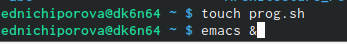{ #fig:0012 width=70% }

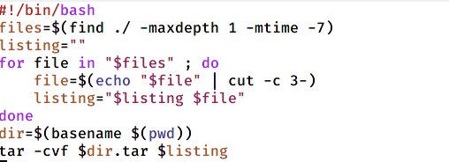{ #fig:0013 width=70% }

## Выполнение
- Проверила работу скрипта, предварительно добавив право на исполнение и созадала новый каталог с несколькими файлами (рис. [-@fig:0014]). Скрипт работает корректно (рис. [-@fig:0015])

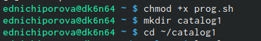{ #fig:0014 width=30% }

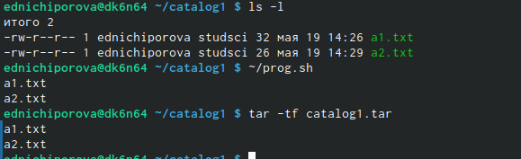{ #fig:0015 width=30% }

## Вывод

- В ходе выполения данной лабораторной работы я изучила основы программирования в оболочке ОС UNIX. Научилась писать болеесложные командные файлы с использованиемлогических управляющих конструкцийи циклов

