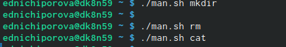
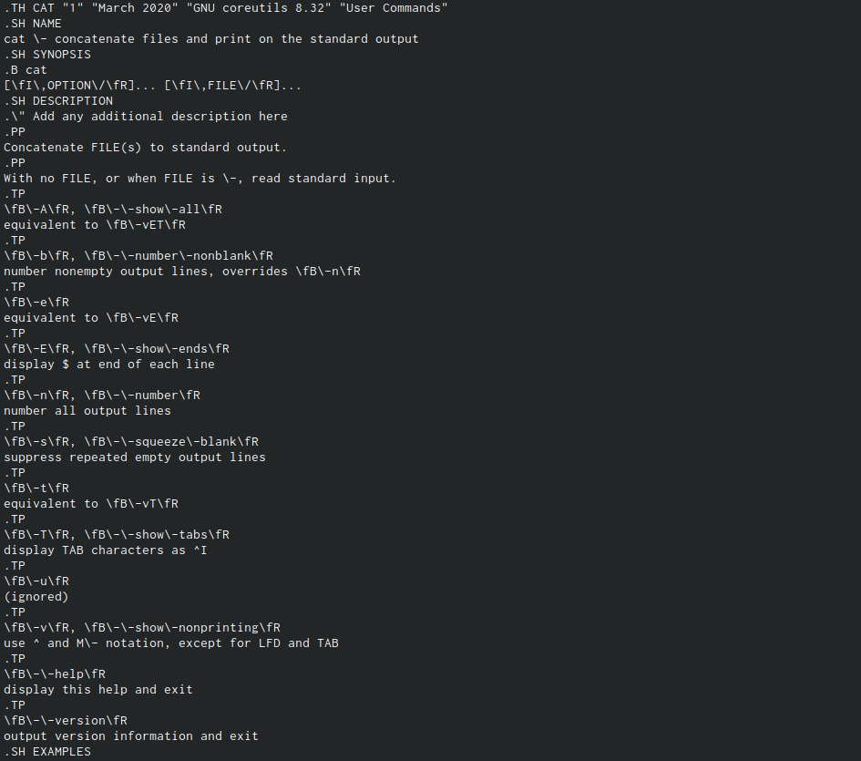

---
## Front matter
lang: ru-RU
title: Отчет по лабораторной работе №12
author: |
	Ничипорова Елена
institute: |
	РУДН,Москва
date: 23-05-22

## Formatting
toc: false
slide_level: 2
theme: metropolis
header-includes: 
 - \metroset{progressbar=frametitle,sectionpage=progressbar,numbering=fraction}
 - '\makeatletter'
 - '\beamer@ignorenonframefalse'
 - '\makeatother'
aspectratio: 43
section-titles: true
---

# Отчет

## Цель

- Изучить основы программирования в оболочке ОС UNIX. Научиться писать более сложные командные файлы с использованием логических управляющих конструкцийи циклов.

## выполнение

1. Написала командный файл, реализующий упрощённый механизм семафоров. Командный файл должен в течение некоторого времени t1 дожидаться освобождения ресурса,выдавая об этом сообщение,а дождавшись его освобождения,использовать его в течение некоторого времени t2<>t1, также выдавая информацию о том, что ресурс используется соответствующим командным файлом. Для данной задачи я создала новый файл (рис. [-@fig:001])и написала соответсявующий скрипт (рис. [-@fig:002])

{ #fig:001 width=30% }

{ #fig:002 width=30% }

## Выполнение

- Далее я проверила работу написанного скрита, перед этим я предоставила право на исполнение данного файла командой "chmod +x sem.sh". Скрипт работает корректно(рис. [-@fig:003])

{ #fig:003 width=70% }

## Выполнение

 После этого я изменила скрипт так, чтобы его можно было выполнять в нескольких терминалах (рис. [-@fig:004]) (рис. [-@fig:005]) и проверила его работу, но у меня не получилось проверить скрипт, так как было отказано в доступе (рис. [-@fig:006])

{ #fig:004 width=30% }

{ #fig:005 width=30% }

{ #fig:006 width=30% }

## Выполнение

2. Реализовала команду man с помощью командного файла.Изучила содержимое каталога/usr/share/man/man1.(рис. [-@fig:007])В нем находятся архивы текстовых файлов,содержащих справку по большинству установленных в системе программ и команд.Каждый архив можно открыть командой less сразу же просмотрев содержимое справки.Командный файл должен получать в виде аргумента командной строки название команды и в виде результата выдавать справку об этой команде или сообщение об отсутствии справки,если соответствующего файла нет в каталоге man1.

{ #fig:007 width=40% }

## Выполнение

- Для данной задачи я создала новый файл (рис. [-@fig:008]) и написала соответсвующий скрипт(рис. [-@fig:009])

{ #fig:008 width=30% }

{ #fig:009 width=30% }

## выполнение
- Проверила работу скрипта, предварительно добавив право на исполнение файла. Скрипт работает корректно (рис. [-@fig:0010]) (рис. [-@fig:0011]) (рис. [-@fig:0012]) (рис. [-@fig:0013])

{ #fig:0010 width=40% }

{ #fig:0011 width=40% }

## Выполнение

{ #fig:0012 width=40% }

{ #fig:0013 width=40% }

## Выполнение
3. Используя встроенную переменную $RANDOM,написала командный файл,генерирующий случайную последовательность букв латинского алфавита. Для этого создала новый файл и написала соответсвующий скрипт(рис. [-@fig:0014])

{ #fig:0014 width=70% }

## Выполнение
- Проверила работу данного скрипта, предварительно добавив право на исполнение. Скрипт работает корректно (рис. [-@fig:0015])

{ #fig:0015 width=70% }

## Вывод
- Изучила основы программирования в оболочке ОС UNIX. Научилась писать более сложные командные файлы с использованием логических управляющих конструкцийи циклов.
