---
## Front matter
lang: ru-RU
title: Отчет по лабораторной работе №13
author: |
	Ничипорова Елена
institute: |
	РУДН,Москва
date: 25-05-22

## Formatting
toc: false
slide_level: 2
theme: metropolis
header-includes: 
 - \metroset{progressbar=frametitle,sectionpage=progressbar,numbering=fraction}
 - '\makeatletter'
 - '\beamer@ignorenonframefalse'
 - '\makeatother'
aspectratio: 43
section-titles: true
---

# Отчет

## Цель

Приобрести простейшие навыки разработки,анализа,тестирования и отладки приложений в ОС типа UNIX/Linux на примере создания на языке программирования калькулятора с простейшими функциями.

## Выполнение

1. Создаю новый подкаталог ~/work/os/lab_prog(рис. [-@fig:001])
- Создала в каталоге файлы: calculate.h, calculate.c, main.c.(рис. [-@fig:002])
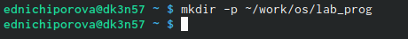{ #fig:001 width=30% }

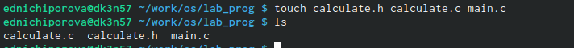{ #fig:002 width=30% }

## Выполнение

- Это будет примитивнейший калькулятор,способный складывать,вычитать,умножать и делить,возводить число в степень,брать квадратный корень,вычислять sin,cos,tan.При запуске он будет запрашивать первое число,операцию,второе число.После этого программа выведет результат и остановится.Реализация функций калькулятора в файле calculate.с:(рис. [-@fig:003])(рис. [-@fig:004])

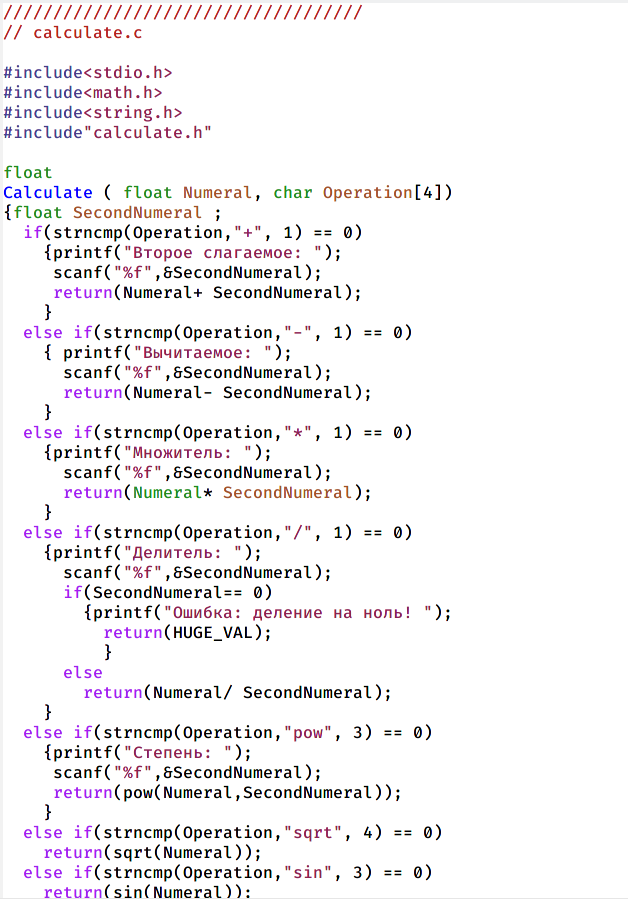{ #fig:003 width=30% }

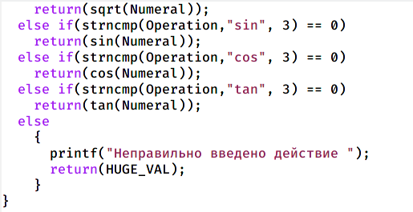{ #fig:004 width=30% }

## Выполнение

- Интерфейсный файлcalculate.h, описывающий формат вызова функции-калькулятора:(рис. [-@fig:005])

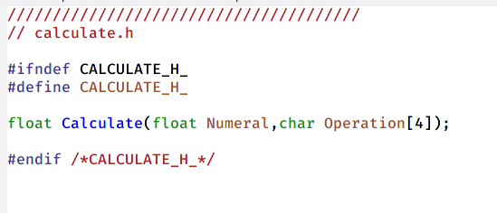{ #fig:005 width=70% }

## Выполнение

- Основной файл main.c,реализующий интерфейс пользователя к калькулятору:(рис. [-@fig:006])

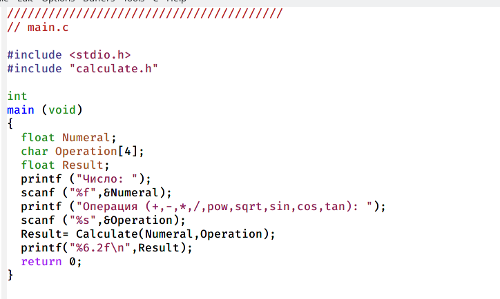{ #fig:006 width=70% }

## Выполнение

- выполнила компиляцию программы посредством gcc(рис. [-@fig:007]). Обнаружила предупреждение в файле main.c и исправила программу(рис. [-@fig:008]). Заново скомпилировала, после этого ошибок не возникло.(рис. [-@fig:009])

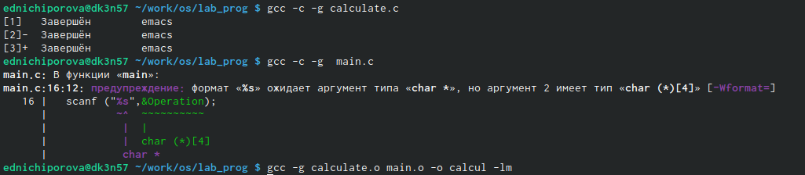{ #fig:007 width=20% }

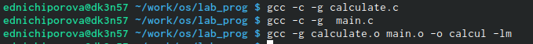{ #fig:008 width=20% }

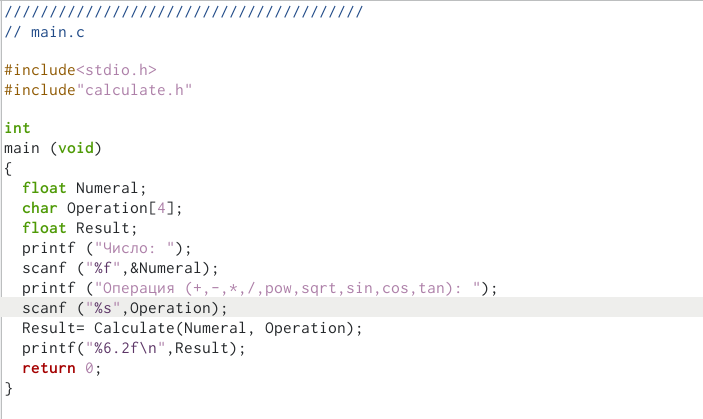{ #fig:009 width=20% }

## Выполнение

- Создала Makefile с необходимым содержанием и исправила его(рис. [-@fig:0010]) Данный файл необходим для автоматической компиляции файлов calculate.c (цель calculate.o), main.c (цель main.o), а также их объединения в один исполняемый файл calcul (цель calcul). Цель clean нужна для автоматического удаления файлов. Переменная CC отвечает за утилиту для компиляции. Переменная CFLAGS отвечает за опции в данной утилите. Переменная LIBS отвечает за опции для объединения объектных файлов в один исполняемый файл.

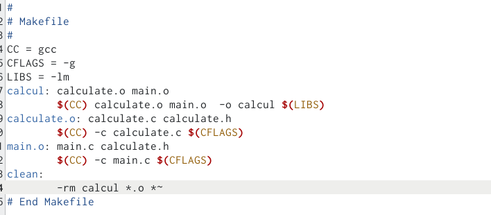{ #fig:0010 width=40% }

## Выполнение

- Удалила исполняемые и объектные файлы из каталога(рис. [-@fig:0011]). Выполнила компиляцию файлов (рис. [-@fig:0012])

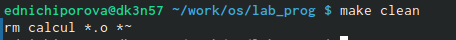{ #fig:0011 width=30% }

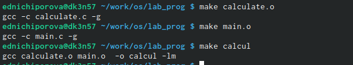{ #fig:0012 width=30% }

## Выполнение

- С помощью gdb выполнила отладку программы calcul. Запустила отладчик GDB(рис. [-@fig:0013])

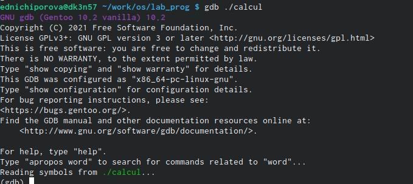{ #fig:0013 width=40% }

## Выполнение

- Запустила программу внутри отладчика(рис. [-@fig:0014]). Постранично просмотрела исходный код с помощью команды "list"(рис. [-@fig:0015])
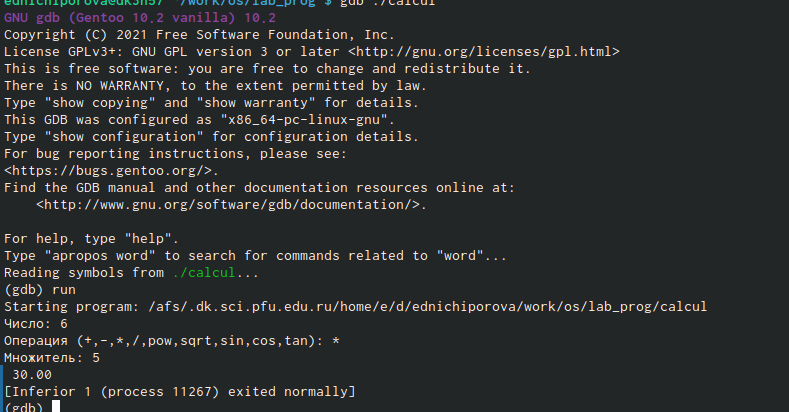{ #fig:0014 width=30% }

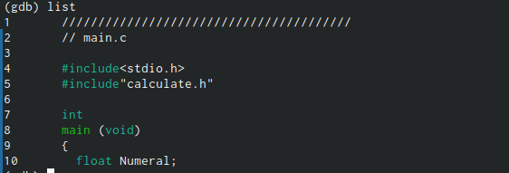{ #fig:0015 width=30% }

## Выполнение

- просмотрела строки 12-15 с помощью команды "list 12,15"(рис. [-@fig:0016])
- Просмотрела определенные строки(рис. [-@fig:0017])
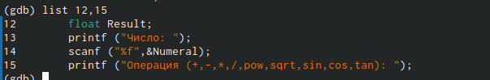{ #fig:0016 width=30% }

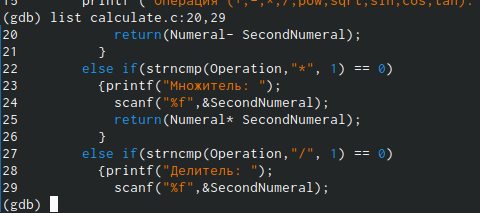{ #fig:0017 width=30% }

## Выполнение

- Поставила точку останова в файле calculate.c на 21 строке(рис. [-@fig:0018]).Вывела информацию о имеющихся точках останова (рис. [-@fig:0019])
{ #fig:0018 width=70% }

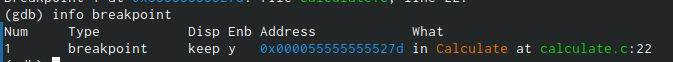{ #fig:0019 width=70% }

## Выполнение

- Запустила программу внутри отладчика и убедилась, что программа остановилась в момент прохождения точки останова. Посмотрела, чему равно на этом этапе значениие переменной Numeral, сравнила с результатом вывода на экран после инспользования команды "display Numeral". Значения совпадают(рис. [-@fig:0020])

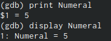{ #fig:0020 width=70% }

## Выполнение

- Убрала точки останова(рис. [-@fig:0021])

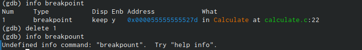{ #fig:0021 width=70% }

## Выполнение

- С помощью утилиты splint проанализируем коды файлов calculate.c и main.c. Воспользуемся командами splint calculate.c и splint main.c. C помощью утилиты splint выяснилось, что в файлах calculate.c и main.c присутствует функция чтения scanf, возвращающая целое число (тип int), но эти числа не используются и нигде не сохранятся. Утилита вывела предупреждение о том, что в файле calculate.c происходит сравнение вещественного числа с нулем. Также возвращаемые значения (тип double) в функциях pow, sqrt, sin, cos и tan записываются в переменную типа float, что свидетельствует о потери данных.

## Вывод

Приобрела простейшие навыки разработки,анализа,тестирования и отладки при-ложений в ОС типа UNIX/Linux на примере создания на языке программированияС калькулятора с простейшими функциями.
