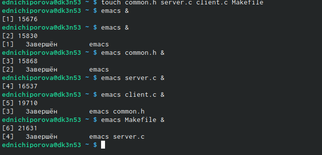
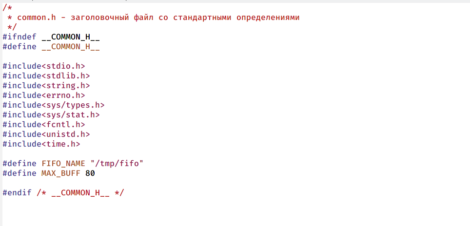
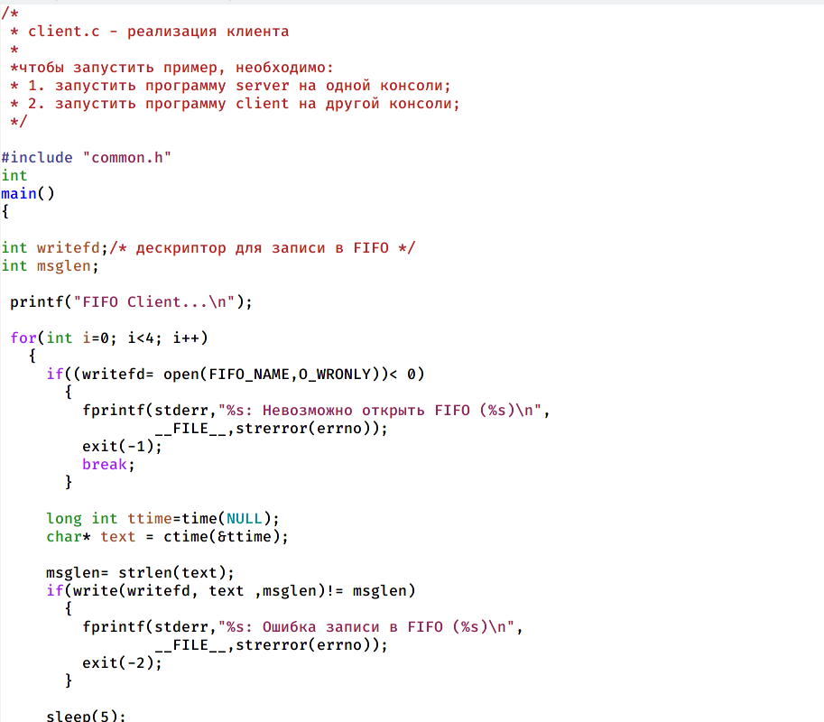
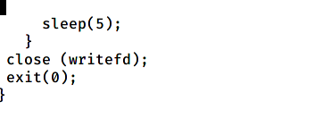
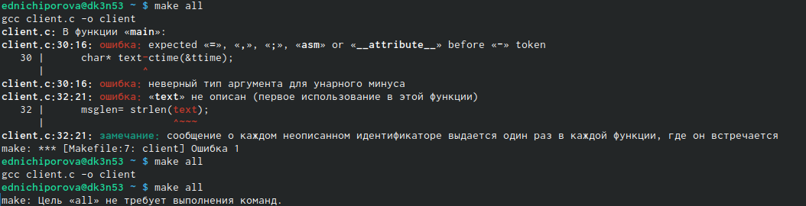
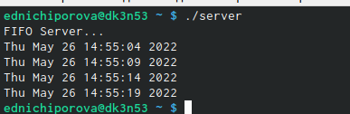
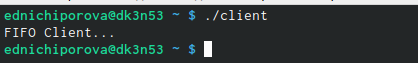

---
## Front matter
lang: ru-RU
title: Отчет по лабораторной работе №14
author: |
	Ничипорова Елена
institute: |
	РУДН,Москва
date: 26-05-22

## Formatting
toc: false
slide_level: 2
theme: metropolis
header-includes: 
 - \metroset{progressbar=frametitle,sectionpage=progressbar,numbering=fraction}
 - '\makeatletter'
 - '\beamer@ignorenonframefalse'
 - '\makeatother'
aspectratio: 43
section-titles: true
---

# Отчет

## Цель

Приобретение практических навыков работы с именованными каналами.

## Выполнение

- В начале я создала необходимые файлы и открыла их в редакторе emacs(рис. [-@fig:001])

{ #fig:001 width=40% }

## Выполнение
- Далее я изменила коды программ, представленных в тексте лабораторной работы. В файл common.h добавила стандартные заголовочные файлы unistd.h и time.h, необходимые для работы других файлов.Этот файл предназначен для заголовочных файлов, чтобы не прописывать их в других программах каждый раз.(рис. [-@fig:002])

{ #fig:002 width=40% }

## Выполнение

- В файле client.c добавила цикл, который отвечает за колличество сообщений 0 текущем времени (4 сообщения), которое получается в результате выполнения командна Рисунке 7 и команду sleep(5) для приостановки работы клиента на 5 секунд (рис. [-@fig:005])(рис. [-@fig:006])

{ #fig:005 width=30% }

{ #fig:006 width=30% }

## Выполнение

- Mekefile, то есть файл для сборки, я оставила без изменения. После написания кодов, я использую команду "make all" для компиляции необходимых файлов(рис. [-@fig:007])

{ #fig:007 width=40% }

## Выполнение

- Откроем три терминала. В первом окне запустим команду ./server.c, во втором и третьем - ./client.c. В результате каждый терминал-клиент вывел по четыре сообщения о текущем времени. Спустя 30 секунд работа сервера была прекращена.Если клиент завершит свою работу, не закрыв канал, то при повторном запуске сервера, появится ошибка "Невозможно создать FIFO", так как уже существует один канал.(рис. [-@fig:008])(рис. [-@fig:009])

{ #fig:008 width=30% }

{ #fig:009 width=30% }

## Вывод

Я приобрела практические навыки работы с именованными каналами.

