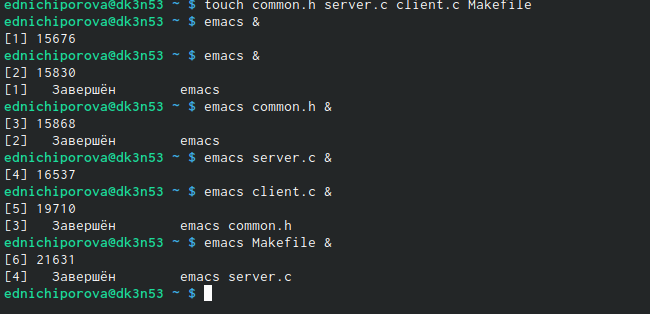
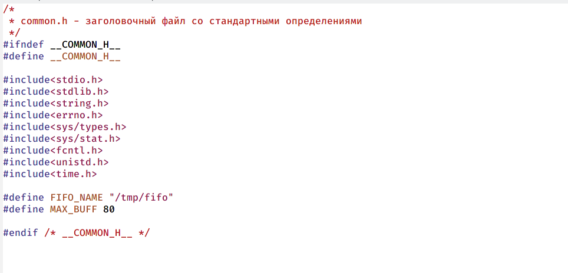
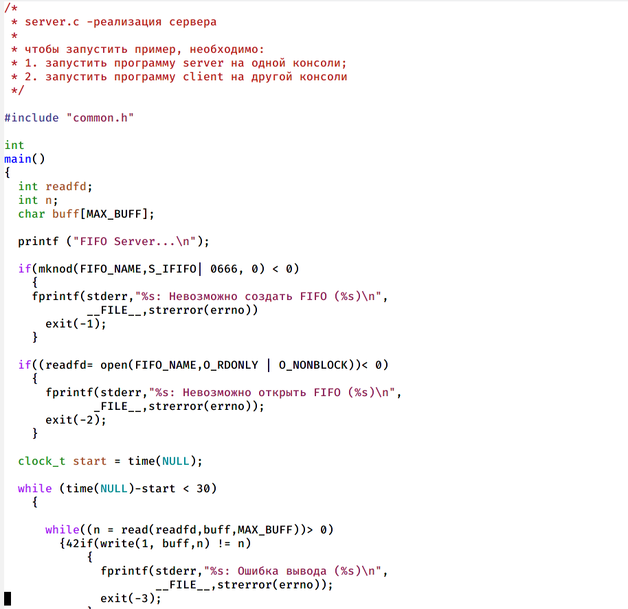
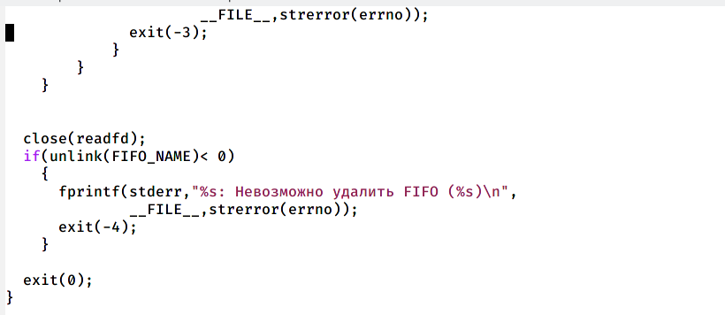
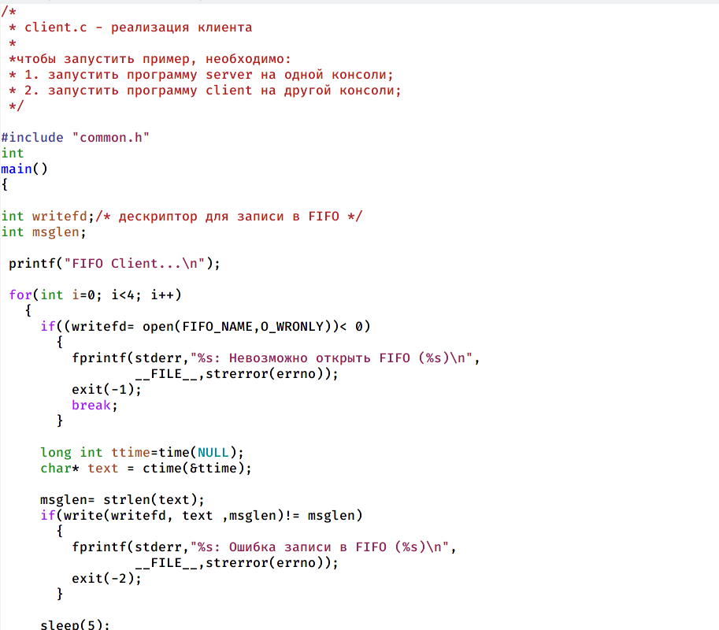
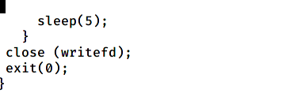
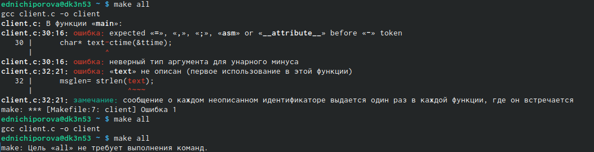
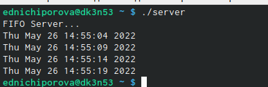
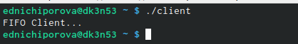

---
## Front matter
title: "Отчет по лабораторной работе №14"
subtitle: "Операционные системы"
author: "Ничипорова Елена Дмитриевна"

## Generic otions
lang: ru-RU
toc-title: "Содержание"

## Bibliography
bibliography: bib/cite.bib
csl: pandoc/csl/gost-r-7-0-5-2008-numeric.csl

## Pdf output format
toc: true # Table of contents
toc-depth: 2
lof: true # List of figures
lot: true # List of tables
fontsize: 12pt
linestretch: 1.5
papersize: a4
documentclass: scrreprt
## I18n polyglossia
polyglossia-lang:
  name: russian
  options:
	- spelling=modern
	- babelshorthands=true
polyglossia-otherlangs:
  name: english
## I18n babel
babel-lang: russian
babel-otherlangs: english
## Fonts
mainfont: PT Serif
romanfont: PT Serif
sansfont: PT Sans
monofont: PT Mono
mainfontoptions: Ligatures=TeX
romanfontoptions: Ligatures=TeX
sansfontoptions: Ligatures=TeX,Scale=MatchLowercase
monofontoptions: Scale=MatchLowercase,Scale=0.9
## Biblatex
biblatex: true
biblio-style: "gost-numeric"
biblatexoptions:
  - parentracker=true
  - backend=biber
  - hyperref=auto
  - language=auto
  - autolang=other*
  - citestyle=gost-numeric
## Pandoc-crossref LaTeX customization
figureTitle: "Рис."
tableTitle: "Таблица"
listingTitle: "Листинг"
lofTitle: "Список иллюстраций"
lotTitle: "Список таблиц"
lolTitle: "Листинги"
## Misc options
indent: true
header-includes:
  - \usepackage{indentfirst}
  - \usepackage{float} # keep figures where there are in the text
  - \floatplacement{figure}{H} # keep figures where there are in the text
---

# Цель работы

Приобретение практических навыков работы с именованными каналами.

# Выполнение лабораторной работы

- В начале я создала необходимые файлы и открыла их в редакторе emacs(рис. [-@fig:001])

{ #fig:001 width=70% }

- Далее я изменила коды программ, представленных в тексте лабораторной работы. В файл common.h добавила стандартные заголовочные файлы unistd.h и time.h, необходимые для работы других файлов.Этот файл предназначен для заголовочных файлов, чтобы не прописывать их в других программах каждый раз.(рис. [-@fig:002])

{ #fig:002 width=70% }

- В файл server.c добавила цикл while для контроля за временем работы сервера. Разница между временем работы time(NULL) и временем начала работы не должна превышать 30 секунд.(рис. [-@fig:003])(рис. [-@fig:004])

{ #fig:003 width=70% }

{ #fig:004 width=70% }

- В файле client.c добавила цикл, который отвечает за колличество сообщений 0 текущем времени (4 сообщения), которое получается в результате выполнения командна Рисунке 7 и команду sleep(5) для приостановки работы клиента на 5 секунд (рис. [-@fig:005])(рис. [-@fig:006])

{ #fig:005 width=70% }

{ #fig:006 width=70% }

- Mekefile, то есть файл для сборки, я оставила без изменения

- После написания кодов, я использую команду "make all" для компиляции необходимых файлов(рис. [-@fig:007])

{ #fig:007 width=70% }

- Откроем три терминала. В первом окне запустим команду ./server.c, во втором и третьем - ./client.c. В результате каждый терминал-клиент вывел по четыре сообщения о текущем времени. Спустя 30 секунд работа сервера была прекращена.Если клиент завершит свою работу, не закрыв канал, то при повторном запуске сервера, появится ошибка "Невозможно создать FIFO", так как уже существует один канал.(рис. [-@fig:008])(рис. [-@fig:009])

{ #fig:008 width=70% }

{ #fig:009 width=70% }
# Выводы

Я приобрела практические навыки работы с именованными каналами.

# Список литературы{.unnumbered}

::: {#refs}
:::
