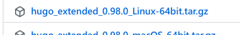
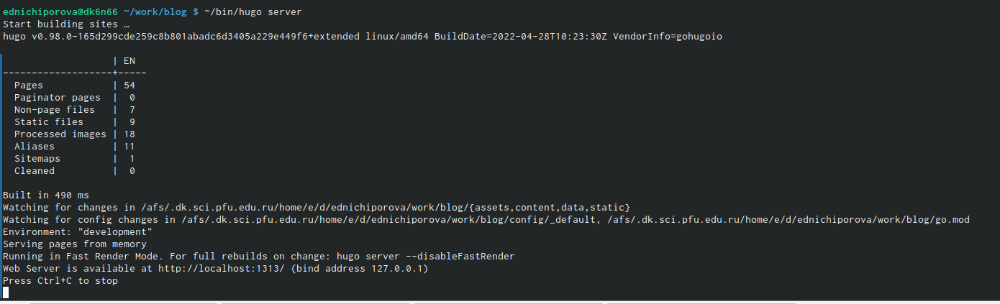
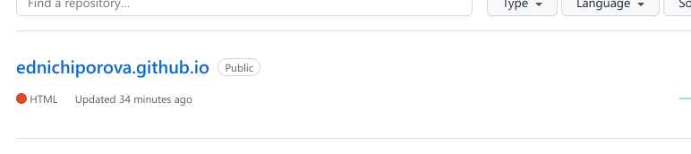
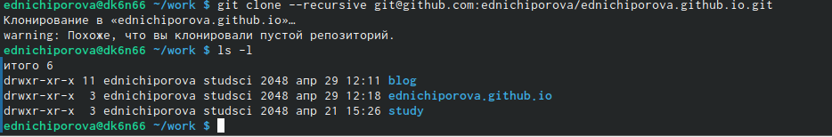
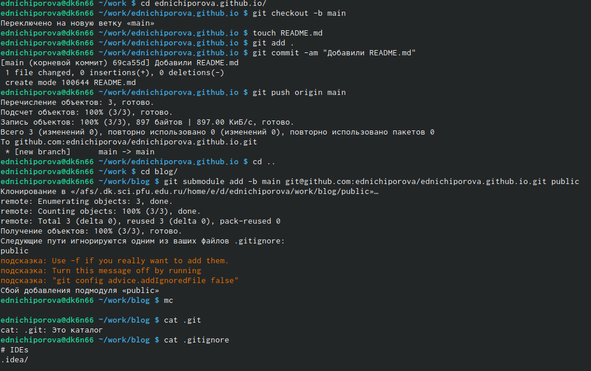
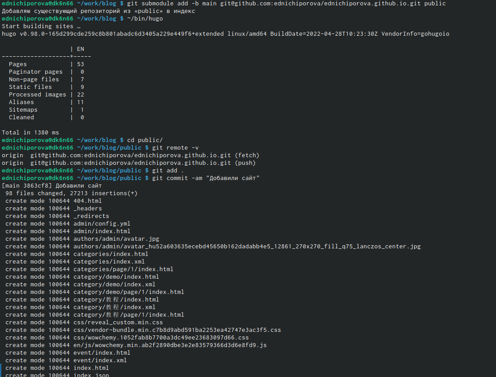

---
## Front matter
lang: ru-RU
title: Отчет по первому этапу индивидуального проекта
author: |
	Ничипорова Елена
institute: |
	РУДН, Москва
date: 29-04-22

## Formatting
toc: false
slide_level: 2
theme: metropolis
header-includes: 
 - \metroset{progressbar=frametitle,sectionpage=progressbar,numbering=fraction}
 - '\makeatletter'
 - '\beamer@ignorenonframefalse'
 - '\makeatother'
aspectratio: 43
section-titles: true
---

# Отчет по индивидуальному проекту 1 этап

## Цель

Научиться размещать на Github pages заготовки для персонального сайта

## Ход работы
Скачиваем исполняемый файл hugo, для того, чтобы генерировать страницы сайта. Ссылку на этот репозиторий находится в описании индивидуального проекта.(рис. [-@fig:001])

{ #fig:001 width=70% }

## Ход работы
- Копируем репозиторий с ТУИСа в свой Github 
- Далее копируем ссылку и клонируем его
## Ход работы

В каталоге blog запускаем hugo командой ~/bin/nugo server. Копируем ссылку и переходим в браузер, здесь мы можем увидеть сайт, но его мы видим только на нашем компьютере.(рис. [-@fig:002])
{ #fig:002 width=70% }

## Ход работы

- Удаляем один из файлов: открывает каталог work/content/home и удаляем файл demo.md
- Теперь переносим сайт в репозиторий. Для этого создаем еще один репозиторий с именем ednichiporova.github.io(рис. [-@fig:003])
{ #fig:003 width=70% }

## Ход работы

- Переходим в каталог work и клонируем репозиторий(рис. [-@fig:004])
- Создаем ветку main в репозитории командой git checkout -b main(рис. [-@fig:005])
{ #fig:004 width=70% }
{ #fig:005 width=70% }

## Ход работы

- Создаем пустой файл README.md и добавляем его
- Переходим в каталог blog и подключаем только что созданный репозиторий к папке public
- Находясь в каталоге blog выполняем ~/bin/hugo. Теперь в каталоге public автоматически появились файлы, которые будут являться файлами нашего сайта

## Ход работы

- Синхранизируем эти файлы с репозиторием (рис. [-@fig:006])
{ #fig:006 width=70% }

## Ход работы

- Открываем в браузере наш сайт(рис. [-@fig:007])
{ #fig:007 width=70% }
## Вывод
В результате выполненной работы я научилась размещать на Github pages заготовки для персонального сайта

