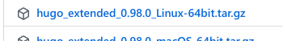
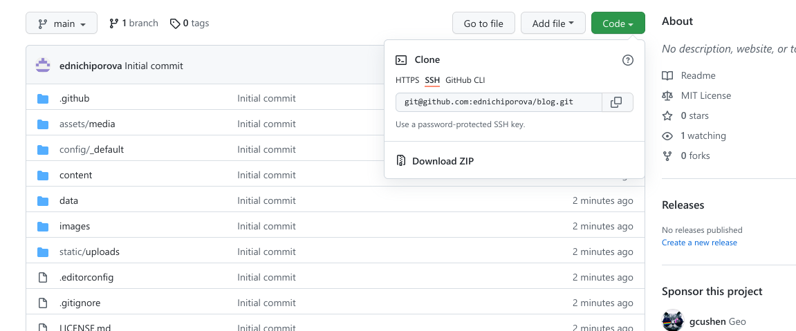
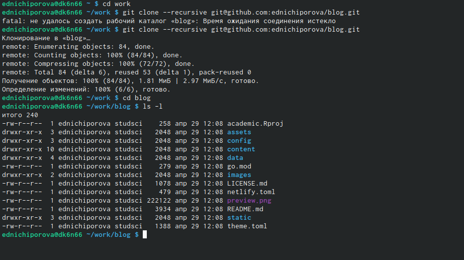
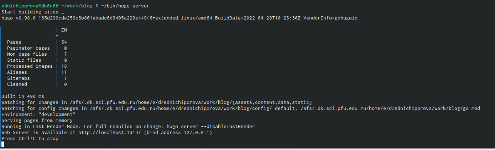
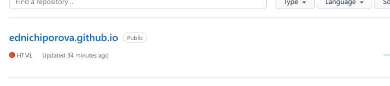
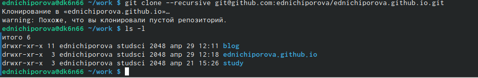
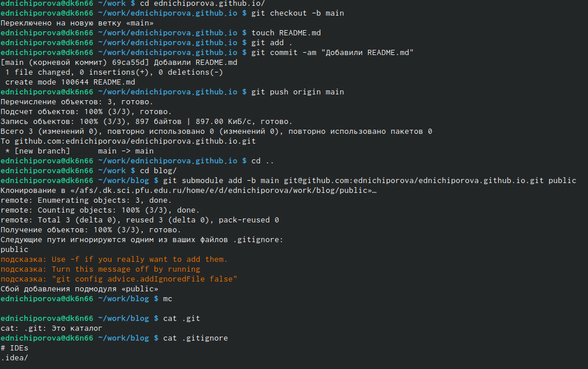
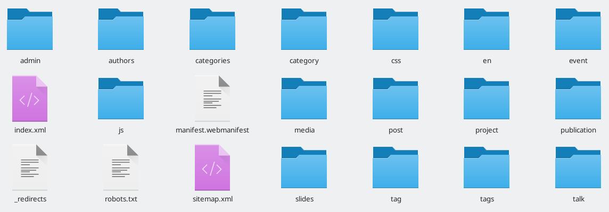
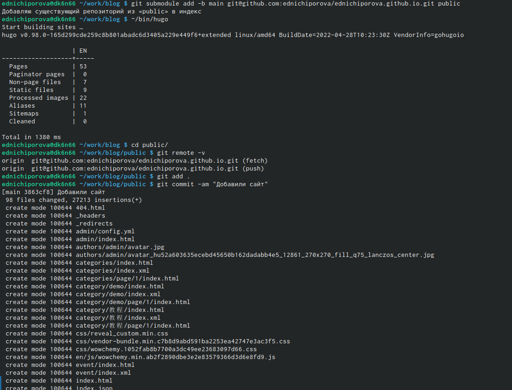

---
## Front matter
title: "Отчет по 1 этапу индивидуального проекта"
subtitle: "Операционные системы"
author: "Ничипорова Елена Дмитриевна"

## Generic otions
lang: ru-RU
toc-title: "Содержание"

## Bibliography
bibliography: bib/cite.bib
csl: pandoc/csl/gost-r-7-0-5-2008-numeric.csl

## Pdf output format
toc: true # Table of contents
toc-depth: 2
lof: true # List of figures
lot: true # List of tables
fontsize: 12pt
linestretch: 1.5
papersize: a4
documentclass: scrreprt
## I18n polyglossia
polyglossia-lang:
  name: russian
  options:
	- spelling=modern
	- babelshorthands=true
polyglossia-otherlangs:
  name: english
## I18n babel
babel-lang: russian
babel-otherlangs: english
## Fonts
mainfont: PT Serif
romanfont: PT Serif
sansfont: PT Sans
monofont: PT Mono
mainfontoptions: Ligatures=TeX
romanfontoptions: Ligatures=TeX
sansfontoptions: Ligatures=TeX,Scale=MatchLowercase
monofontoptions: Scale=MatchLowercase,Scale=0.9
## Biblatex
biblatex: true
biblio-style: "gost-numeric"
biblatexoptions:
  - parentracker=true
  - backend=biber
  - hyperref=auto
  - language=auto
  - autolang=other*
  - citestyle=gost-numeric
## Pandoc-crossref LaTeX customization
figureTitle: "Рис."
tableTitle: "Таблица"
listingTitle: "Листинг"
lofTitle: "Список иллюстраций"
lotTitle: "Список таблиц"
lolTitle: "Листинги"
## Misc options
indent: true
header-includes:
  - \usepackage{indentfirst}
  - \usepackage{float} # keep figures where there are in the text
  - \floatplacement{figure}{H} # keep figures where there are in the text
---

# Цель работы

Научиться размещать на Github pages заготовки для персонального сайта

# Задание

   - Установить необходимое программное обеспечение.
   - Скачать шаблон темы сайта.
   - Разместить его на хостинге git.
   - Установить параметр для URLs сайта
   - Разместить заготовку сайта на Github pages.

# Ход работы

- Скачиваем исполняемый файл hugo, для того, чтобы генерировать страницы сайта. Ссылку на этот репозиторий находится в описании индивидуального проекта.(рис. [-@fig:001])

{ #fig:001 width=70% }

- Создем в домашней папке пустую папку bin и копируем туда исполняемый файл
- Копируем репозиторий с ТУИСа в свой Github(рис. [-@fig:002]).Далее копируем ссылку и клонируем его.(рис. [-@fig:003])
{ #fig:002 width=70% }
{ #fig:003 width=70% }
- В каталоге blog запускаем hugo командой ~/bin/nugo server. Копируем ссылку и переходим в браузер, здесь мы можем увидеть сайт, но его мы видим только на нашем компьютере.(рис. [-@fig:004])
{ #fig:004 width=70% }
- Удаляем один из файлов: открывает каталог work/content/home и удаляем файл demo.md
- Теперь переносим сайт в репозиторий. Для этого создаем еще один репозиторий с именем ednichiporova.github.io(рис. [-@fig:005])
{ #fig:005 width=70% }
- Переходим в каталог work и клонируем репозиторий(рис. [-@fig:006])
{ #fig:006 width=70% }
- Создаем ветку main в репозитории командой git checkout -b main(рис. [-@fig:007])
{ #fig:007 width=70% }
- Создаем пустой файл README.md и добавляем его
- Переходим в каталог blog и подключаем только что созданный репозиторий к папке public(рис. [-@fig:007])
- Находясь в каталоге blog выполняем ~/bin/hugo. Теперь в каталоге public автоматически появились файлы, которые будут являться файлами нашего сайта(рис. [-@fig:008])
{ #fig:008 width=70% }
- Синхранизируем эти файлы с репозиторием (рис. [-@fig:009])
{ #fig:009 width=70% }
- Открываем в браузере наш сайт(рис. [-@fig:0010])
{ #fig:0010 width=70% }

# Выводы

В результате выполненной работы я научилась размещать на Github pages заготовки для персонального сайта

::: {#refs}
:::
