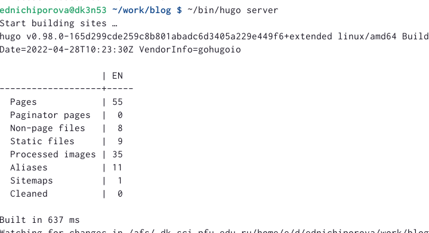
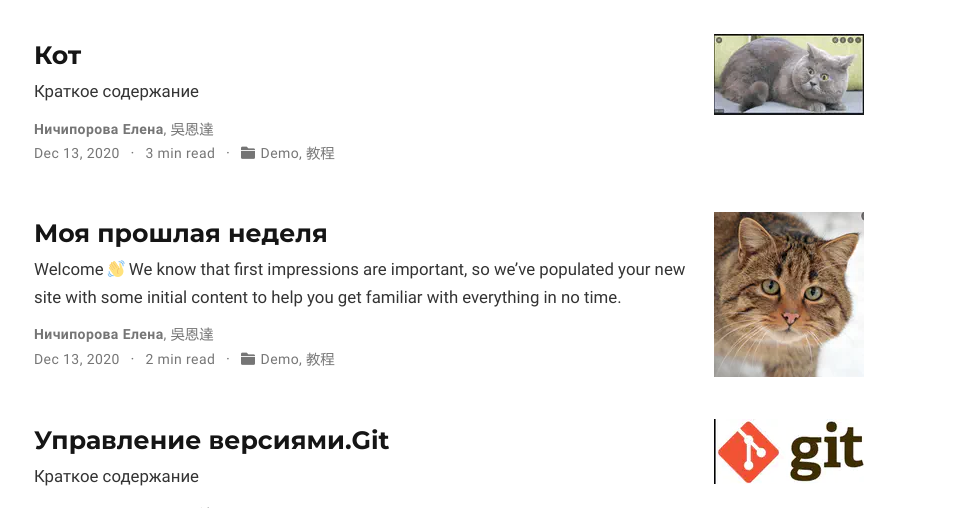

---
## Front matter
lang: ru-RU
title: Отчет по второму этапу проекта
author: |
	Ничипорова Елена
institute: |
	РУДН,Москва
date: 5-05-22

## Formatting
toc: false
slide_level: 2
theme: metropolis
header-includes: 
 - \metroset{progressbar=frametitle,sectionpage=progressbar,numbering=fraction}
 - '\makeatletter'
 - '\beamer@ignorenonframefalse'
 - '\makeatother'
aspectratio: 43
section-titles: true
---

# Отчет по второму этапу проекта

## Цель

Научиться добавлять файлы на сайт
## Выполнение

- В папке blog запускаем hugo командой "~/bin/hugo server"(рис. [-@fig:006])

{ #fig:006 width=70% }

## Выполнение

- Размещаем фотографию владельца сайта. Для этого переходим в каталог work->blog->content->autors->admin и меняем изобраение на свое(рис. [-@fig:001])

{ #fig:001 width=70% }

- Далее в документе маркдаун изменяем данные о себе:биографию, интересы и образование

## Выполнение

- Далее выходим из папки autors и заходим в папку post
- Пишем два поста: один о своей прошлой неделе, другой по одной из представленных на ТУИСе тем. Я выбрала тему "Управление версиями.Git." Также я создала пробный пост example.(рис. [-@fig:005])

{ #fig:005 width=70% }

## Выполнение

- После завершения всех измененийв папке blog запускаем ~/bin/hugo
- Далее сохраняем все изменения как в папке blog, так и в папке public

## Вывод

В результате выполнение этого этапа персонального проекта я научилась изменять информацию на сайте, добавлять посты и файлы

## {.standout}

Wer's nicht glaubt, bezahlt einen Taler
