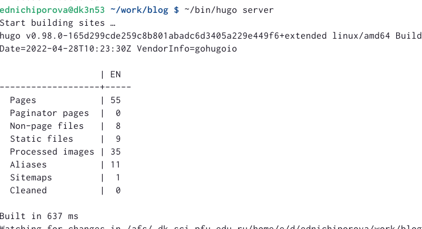
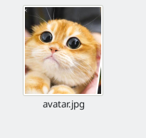
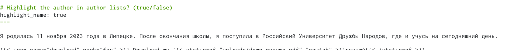
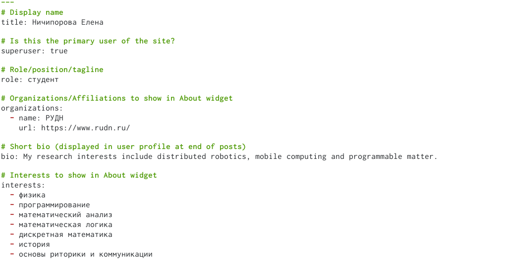
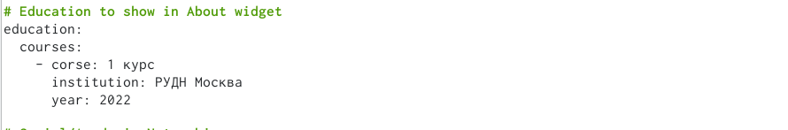
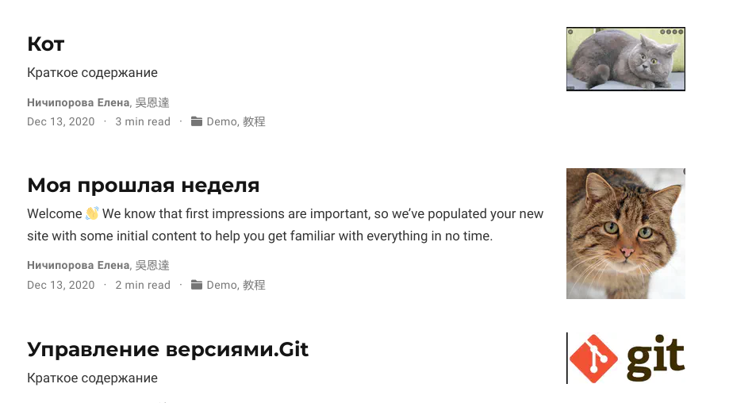
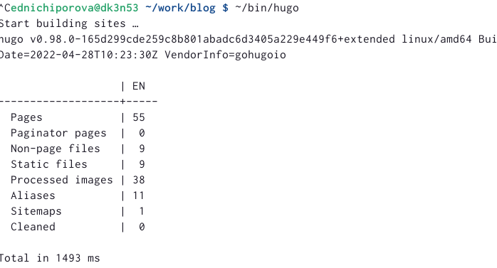
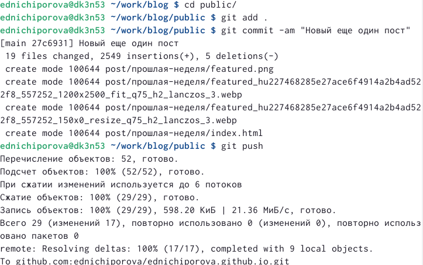

---
## Front matter
title: "Отчет по второму этапу проекта"
subtitle: "Операциооные системы"
author: "Ничипорова Елена Дмитриевна"

## Generic otions
lang: ru-RU
toc-title: "Содержание"

## Bibliography
bibliography: bib/cite.bib
csl: pandoc/csl/gost-r-7-0-5-2008-numeric.csl

## Pdf output format
toc: true # Table of contents
toc-depth: 2
lof: true # List of figures
lot: true # List of tables
fontsize: 12pt
linestretch: 1.5
papersize: a4
documentclass: scrreprt
## I18n polyglossia
polyglossia-lang:
  name: russian
  options:
	- spelling=modern
	- babelshorthands=true
polyglossia-otherlangs:
  name: english
## I18n babel
babel-lang: russian
babel-otherlangs: english
## Fonts
mainfont: PT Serif
romanfont: PT Serif
sansfont: PT Sans
monofont: PT Mono
mainfontoptions: Ligatures=TeX
romanfontoptions: Ligatures=TeX
sansfontoptions: Ligatures=TeX,Scale=MatchLowercase
monofontoptions: Scale=MatchLowercase,Scale=0.9
## Biblatex
biblatex: true
biblio-style: "gost-numeric"
biblatexoptions:
  - parentracker=true
  - backend=biber
  - hyperref=auto
  - language=auto
  - autolang=other*
  - citestyle=gost-numeric
## Pandoc-crossref LaTeX customization
figureTitle: "Рис."
tableTitle: "Таблица"
listingTitle: "Листинг"
lofTitle: "Список иллюстраций"
lotTitle: "Список таблиц"
lolTitle: "Листинги"
## Misc options
indent: true
header-includes:
  - \usepackage{indentfirst}
  - \usepackage{float} # keep figures where there are in the text
  - \floatplacement{figure}{H} # keep figures where there are in the text
---

# Цель работы

Научиться добавлять файлы на сайт
# Задание

Добавить на созданный на прошлой неделе сайт данные о себе: биографию, картинку, интересы, образование,а также сделать два поста

# Выполнение лабораторной работы
- В папке blog запускаем hugo командой "~/bin/hugo server"(рис. [-@fig:006])

{ #fig:006 width=70% }

- Размещаем фотографию владельца сайта. Для этого переходим в каталог work->blog->content->autors->admin и меняем изобраение на свое(рис. [-@fig:001])

{ #fig:001 width=70% }

- Далее в документе маркдаун изменяем данные о себе:биографию(рис. [-@fig:003]), интересы(рис. [-@fig:004]) и образование(рис. [-@fig:002])

{ #fig:003 width=70% }
{ #fig:004 width=70% }
{ #fig:002 width=70% }

- Далее выходим из папки autors и заходим в папку post
- Пишем два поста: один о своей прошлой неделе, другой по одной из представленных на ТУИСе тем. Я выбрала тему "Управление версиями.Git." Также я создала пробный пост example.(рис. [-@fig:005])

{ #fig:005 width=70% }
- После завершения всех измененийв папке blog запускаем ~/bin/hugo (рис. [-@fig:007])

{ #fig:007 width=70% }
- Далее сохраняем все изменения как в папке blog(рис. [-@fig:008]), так и в папке public(рис. [-@fig:009])

{ #fig:008 width=70% }

{ #fig:009 width=70% }
# Выводы

В результате выполнение этого этапа персонального проекта я научилась изменять информацию на сайте, добавлять посты и файлы

::: {#refs}
:::
