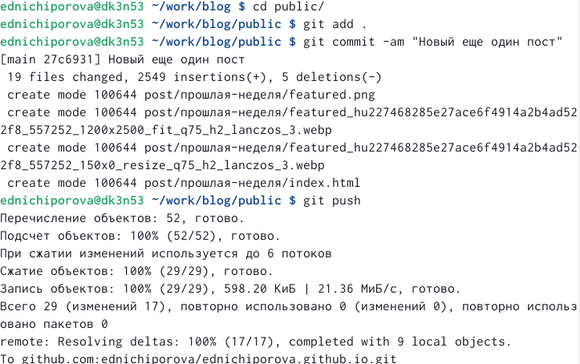

---
## Front matter
lang: ru-RU
title: Отчет по 3 этапу персонального проекта
author: |
	Ничипорова Елена
institute: |
	РУДН,Москва
date: 12-05-22

## Formatting
toc: false
slide_level: 2
theme: metropolis
header-includes: 
 - \metroset{progressbar=frametitle,sectionpage=progressbar,numbering=fraction}
 - '\makeatletter'
 - '\beamer@ignorenonframefalse'
 - '\makeatother'
aspectratio: 43
section-titles: true
---

# Отчет

## Цель

- Добавить на созданный мною сайт информацию о навыках, достижениях и опыте. Также сделать два поста: по прошлой неделе и по одной из тем по выбору

## Выполнение

- В папке blog запускаем hugo командой "~/bin/hugo server"

- Переходим в каталог ~/work/blog/content/home (рис. [-@fig:001])

{ #fig:001 width=70% }

## Выполнение

- Добавляем информацию о навыках, опыте, достижениях. 

## Выполнение

- Выходим из каталога home и заходим в каталог blog, чтобы сделать два поста

- Добавляем два новых поста: о прошлой неделе и о лекговесных языках разметки

## Выполнение

- После завершения всех измененийв папке blog запускаем ~/bin/hugo (рис. [-@fig:002])

{ #fig:002 width=70% }

## Выполнение
- Далее сохраняем все изменения как в папке blog(рис. [-@fig:003]), так и в папке public(рис. [-@fig:004])

{ #fig:003 width=40% }

{ #fig:004 width=40% }

## Вывод

После выполнения данного этапа индивидуального проекта, я научилась добавлять информацио о себе на сайт, а также добавила новые два поста к сайту.

## {.standout}

Wer's nicht glaubt, bezahlt einen Taler
