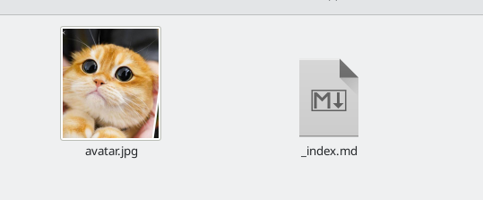
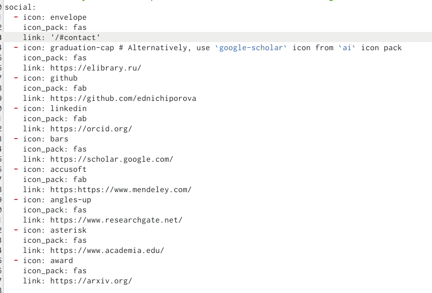
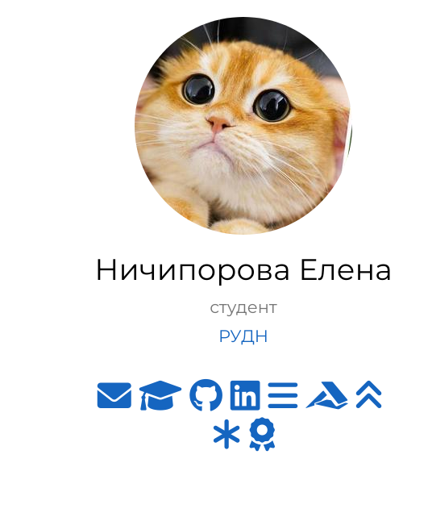
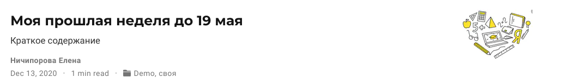
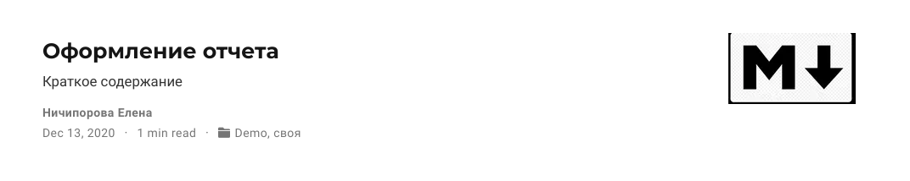
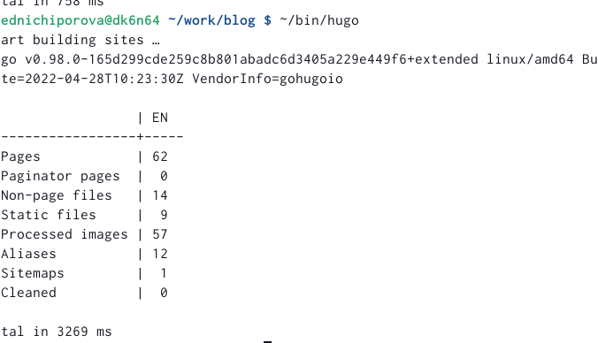
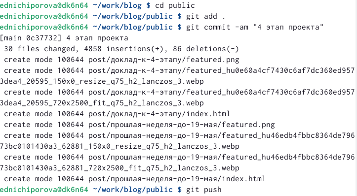
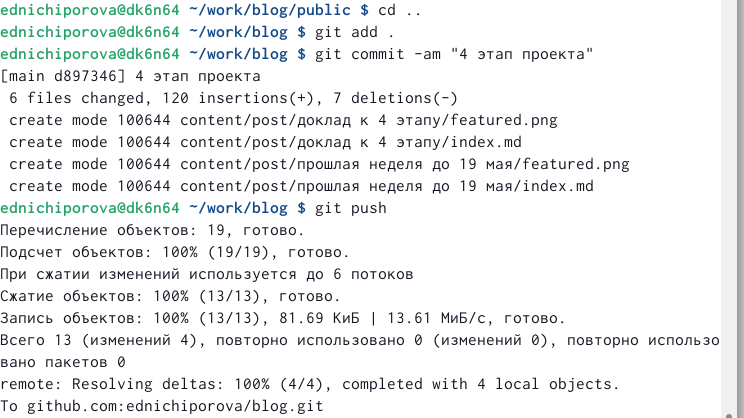

---
## Front matter
lang: ru-RU
title: Отчет по 4 этапу персонального проекта 
author: |
	Ничипорова Елена
institute: |
	РУДН,Москва
date: 19-05-22

## Formatting
toc: false
slide_level: 2
theme: metropolis
header-includes: 
 - \metroset{progressbar=frametitle,sectionpage=progressbar,numbering=fraction}
 - '\makeatletter'
 - '\beamer@ignorenonframefalse'
 - '\makeatother'
aspectratio: 43
section-titles: true
---

# Отчет

## Цель

- Добавить к созданному ранее сайту ссылки на научные и библиографические ресурсы, написать 2 поста: по прошлой неделе и на одну тему по выбору

## Выполнение

- В папке blog запускаем hugo командой "~/bin/hugo server"

- Переходим в каталог ~/work/blog/content/autors/admin(рис. [-@fig:001])

{ #fig:001 width=30% }

## Выполнение

- Добавляем туда ссылки на научные и библеометрические ресурсы (рис. [-@fig:002])

{ #fig:002 width=40% }

## Выполнение

- Вот так это выглядит на моем сайте (рис. [-@fig:003])

{ #fig:003 width=40% }

## Выполнение

- Выходим из каталога home и заходим в каталог blog, чтобы сделать два поста

- Добавляем два новых поста: о прошлой неделе(рис. [-@fig:004]) и о лекговесных языках разметки(рис. [-@fig:005])

{ #fig:004 width=30% }

{ #fig:005 width=30% }

## Выполнение

- После завершения всех измененийв папке blog запускаем ~/bin/hugo (рис. [-@fig:006])

{ #fig:006 width=70% }

## Выполнение

- Далее сохраняем все изменения как в папке blog(рис. [-@fig:007]), так и в папке public(рис. [-@fig:008])

{ #fig:007 width=30% }

{ #fig:008 width=30% }

## Вывод

- После выполнения данного этапа персонального проекта я научилась добавлять информацию о себе на сайт, а также написала два поста
