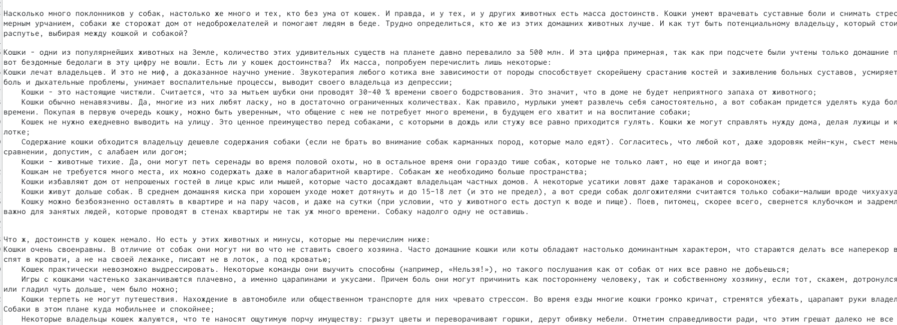
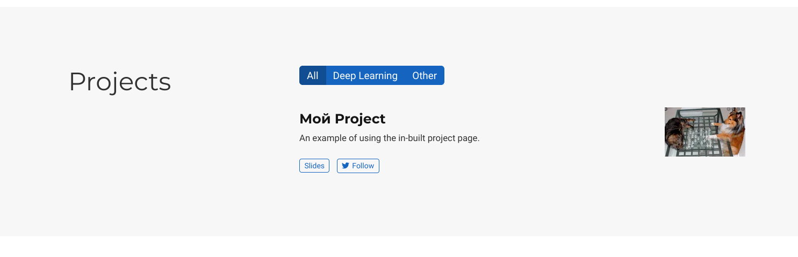
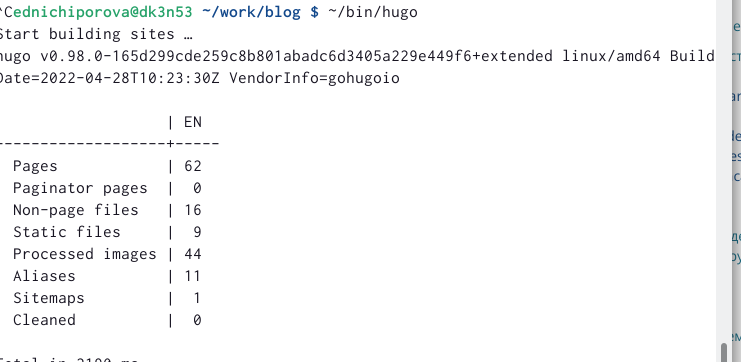
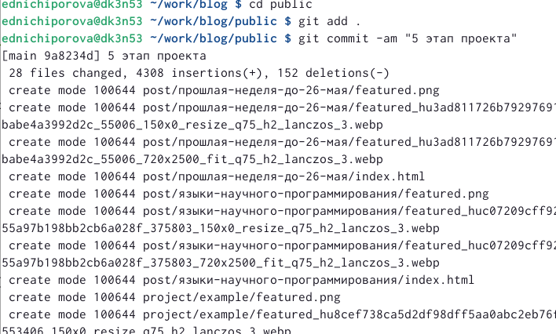

---
## Front matter
lang: ru-RU
title: Отчет по 5 этапу персонального проекта
author: |
	Ничипорова Елена
institute: |
	РУДН,Москва
date: 26-05-22

## Formatting
toc: false
slide_level: 2
theme: metropolis
header-includes: 
 - \metroset{progressbar=frametitle,sectionpage=progressbar,numbering=fraction}
 - '\makeatletter'
 - '\beamer@ignorenonframefalse'
 - '\makeatother'
aspectratio: 43
section-titles: true
---

# Отчет

## Цель

Добавить к созданному ранее сайту запись для персонального проекта и два поста

## Выполнение

- В папке blog запускаем hugo командой "~/bin/hugo server"

- Переходим в каталог ~/work/blog/content/progect

## Выполнение

- Добавляем туда информацию о проекте(рис. [-@fig:001])

{ #fig:001 width=40% }

## Выполнение

- Так это выглядит на моем сайте(рис. [-@fig:002])

{ #fig:002 width=40% }

## Выполнение

- Добавляем два новых поста: о прошлой неделе(рис. [-@fig:003]) и о языках научного программирования(рис. [-@fig:004])

{ #fig:003 width=40% }

{ #fig:004 width=40% }

## Выполнение

- После завершения всех измененийв папке blog запускаем ~/bin/hugo (рис. [-@fig:005])

{ #fig:005 width=40% }

## Выполнение

- Далее сохраняем все изменения как в папке blog(рис. [-@fig:006]), так и в папке public(рис. [-@fig:007])

{ #fig:006 width=40% }

{ #fig:007 width=40% }

## Вывод

- В результате выполнения данного этапа проекта я добавила записи к своему проекту и написала два поста.
