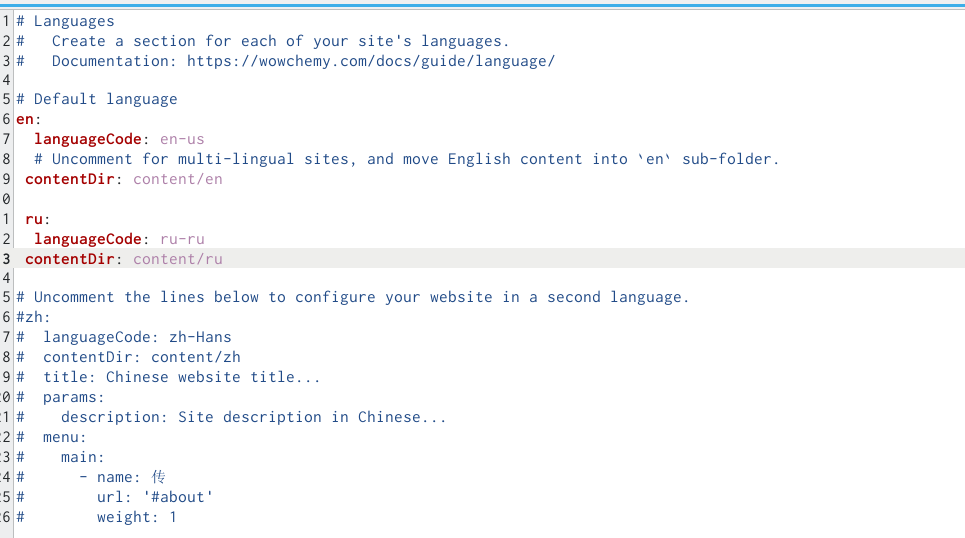
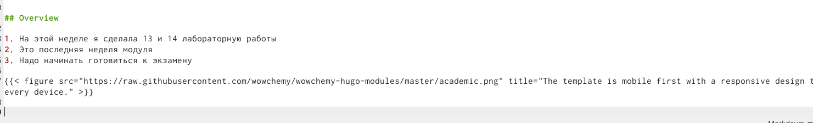
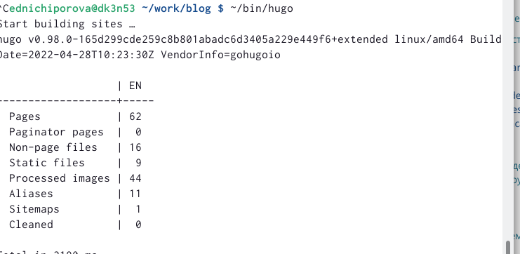
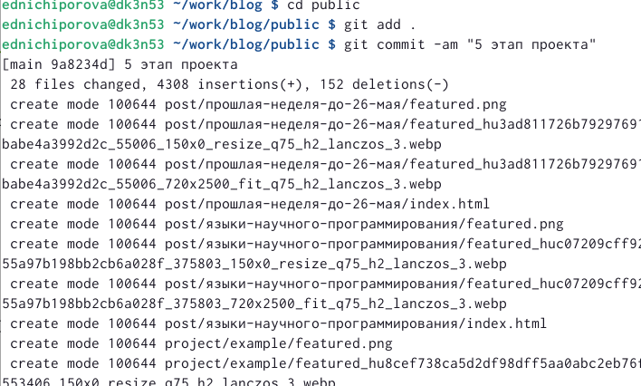
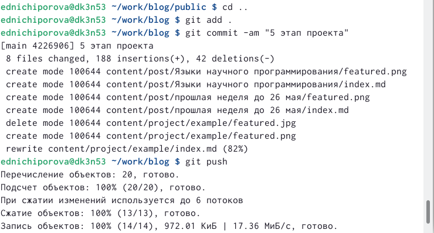

---
## Front matter
lang: ru-RU
title: Отчет по 6 этапу персонального проекта
author: |
	Ничипорова Елена
institute: |
	РУДН,Москва
date: 26-05-22

## Formatting
toc: false
slide_level: 2
theme: metropolis
header-includes: 
 - \metroset{progressbar=frametitle,sectionpage=progressbar,numbering=fraction}
 - '\makeatletter'
 - '\beamer@ignorenonframefalse'
 - '\makeatother'
aspectratio: 43
section-titles: true
---

# Отчет

## Цель

Сделать на своем сайте поддержку английского и русского языков. Добавить два поста

## Выполнение

- В папке blog запускаем hugo командой "~/bin/hugo server"

- Далее делаем поддержку английского и русского языков. В папке blog создаем папку i18n, а в ней создаем файл ru.yaml и скопировала в него тест из инструкции(рис. [-@fig:001])

{ #fig:001 width=30% }

## Выполнение

- в папке content сщздаем две папки, одну из которых называм en (для английского языка) , а вторую ru (для русского языка). и копируем туда все содержимое папки content.

- Далее зашла в файл languages.yaml и добавила блок для поддержки русского языка(рис. [-@fig:002])

{ #fig:002 width=30% }

## Выполнение

- меняем элементы сайта на другой язык

- - Добавляем два новых поста: о прошлой неделе(рис. [-@fig:003]) и о теме по выбору

{ #fig:003 width=70% }

## Выполнение

- После завершения всех измененийв папке blog запускаем ~/bin/hugo (рис. [-@fig:005])

{ #fig:005 width=40% }

## Выполнение

- Далее сохраняем все изменения как в папке blog(рис. [-@fig:006]), так и в папке public(рис. [-@fig:007])

{ #fig:006 width=40% }

{ #fig:007 width=40% }

## Вывод

В результате выполнения данного проекта я научилась создавать сайты, писать в них посты, добавлять информацию о себе, а также устанавливать поддержку английского и русского языка.

