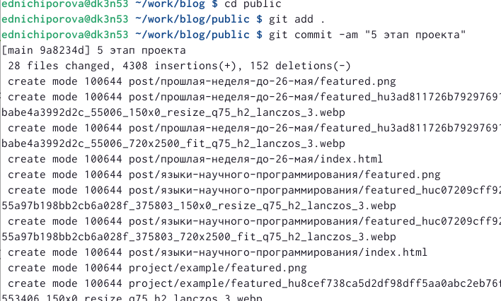

---
## Front matter
title: "Отчет по 6 этапу персонального проекта"
subtitle: "Операционные системы"
author: "Ничипорова Елена Дмитриевна"

## Generic otions
lang: ru-RU
toc-title: "Содержание"

## Bibliography
bibliography: bib/cite.bib
csl: pandoc/csl/gost-r-7-0-5-2008-numeric.csl

## Pdf output format
toc: true # Table of contents
toc-depth: 2
lof: true # List of figures
lot: true # List of tables
fontsize: 12pt
linestretch: 1.5
papersize: a4
documentclass: scrreprt
## I18n polyglossia
polyglossia-lang:
  name: russian
  options:
	- spelling=modern
	- babelshorthands=true
polyglossia-otherlangs:
  name: english
## I18n babel
babel-lang: russian
babel-otherlangs: english
## Fonts
mainfont: PT Serif
romanfont: PT Serif
sansfont: PT Sans
monofont: PT Mono
mainfontoptions: Ligatures=TeX
romanfontoptions: Ligatures=TeX
sansfontoptions: Ligatures=TeX,Scale=MatchLowercase
monofontoptions: Scale=MatchLowercase,Scale=0.9
## Biblatex
biblatex: true
biblio-style: "gost-numeric"
biblatexoptions:
  - parentracker=true
  - backend=biber
  - hyperref=auto
  - language=auto
  - autolang=other*
  - citestyle=gost-numeric
## Pandoc-crossref LaTeX customization
figureTitle: "Рис."
tableTitle: "Таблица"
listingTitle: "Листинг"
lofTitle: "Список иллюстраций"
lotTitle: "Список таблиц"
lolTitle: "Листинги"
## Misc options
indent: true
header-includes:
  - \usepackage{indentfirst}
  - \usepackage{float} # keep figures where there are in the text
  - \floatplacement{figure}{H} # keep figures where there are in the text
---

# Цель работы

Сделать на своем сайте поддержку английского и русского языков. Добавить два поста

# Выполнение лабораторной работы

- В папке blog запускаем hugo командой "~/bin/hugo server"

- Далее делаем поддержку английского и русского языков. В папке blog создаем папку i18n, а в ней создаем файл ru.yaml и скопировала в него тест из инструкции(рис. [-@fig:001])

{ #fig:001 width=70% }

- в папке content сщздаем две папки, одну из которых называм en (для английского языка) , а вторую ru (для русского языка). и копируем туда все содержимое папки content.

- Далее зашла в файл languages.yaml и добавила блок для поддержки русского языка(рис. [-@fig:002])

{ #fig:002 width=70% }

- меняем элементы сайта на другой язык

- - Добавляем два новых поста: о прошлой неделе(рис. [-@fig:003]) и о теме по выбору

{ #fig:003 width=70% }

- После завершения всех измененийв папке blog запускаем ~/bin/hugo (рис. [-@fig:005])

{ #fig:005 width=70% }

- Далее сохраняем все изменения как в папке blog(рис. [-@fig:006]), так и в папке public(рис. [-@fig:007])

{ #fig:006 width=70% }

{ #fig:007 width=70% }

# Выводы

В результате выполнения данного проекта я научилась создавать сайты, писать в них посты, добавлять информацию о себе, а также устанавливать поддержку английского и русского языка.

# Список литературы{.unnumbered}

::: {#refs}
:::
